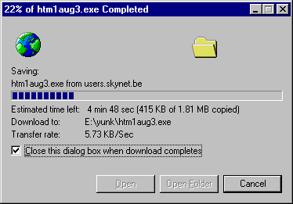
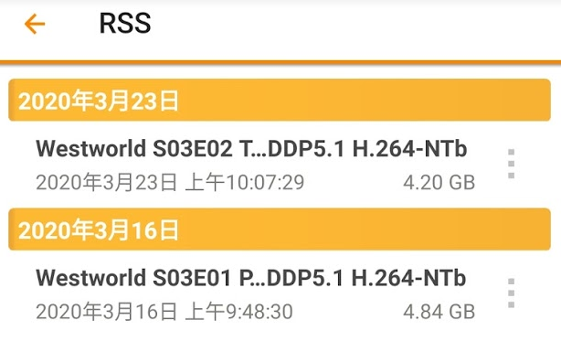

记得第一次下载是在表哥家玩电脑，听别人说可以在网上下载mp3而不需要买磁带了，觉得很神奇，就去找了一首歌下载试试。点了下载，就看一张张纸从一个球飘向一个文件夹，飘了约莫有个把小时还没有下载好。我很着急，因为担心下载歌曲出错，又不敢打CS，傻傻盯着屏幕等。

实在等不住了就去找表哥，表哥说要用个工具下载，然后打开了一个软件，点下载，瞬间就下载好了。我觉得下载软件真是太神奇了，大大节省了时间。当时下载了什么歌曲已经忘记，但还记得那个软件，叫作Flashget。多年以后Flashget的作者似乎因为沉迷魔兽，没有再更新了，这软件也就废了。后来就有了迅雷，也挺好用，尤其是下载完成时叮的那一声，听着特别爽。只是迅雷这个软件越来越臃肿，下载速度也越来越慢，各种会员层出不穷，以至于最终变成卖理财产品。不知从什么时候起经常下载到99%就不动了，也就不再用了。当时还有个叫verycd的网站资源非常多，需要用电驴软件来下载。ed2k协议的机制不太清楚，应该也是类似BT吧，软件默认配置有一套比较合理的上传和下载机制，然而这种平衡被迅雷等吸血软件打破了，只下载不上传，把这个生态都搞坏了。后来PT应运而生，我听说养PT很麻烦，还要考核，就懒得研究了。

大学期间身处教育网，有许多教育网资源，比如各系都有FTP，普遍提供一些电影资源，下载很快。又比如P大流行的Maze，T大流行的Corsair，下载也都很快，资源更是五花八门。这两个软件属于P2P下载了，经常有同学一不小心把自己的个人文档分享出去了，然后就出名了；也有同学劝告我让我别用，说这个软件伤硬盘。我那个时候觉得这么多资源唾手可得，很幸福，不管有没有用，都先下载下来看看。电脑装不下了，就买了光盘，刻盘了存起来。后来离校时搬不走，全丢了。

毕业后租房，离开了教育网，买了一个小米路由器硬盘版，里面有个功能就是自动追剧，一有更新就会自动下载，非常牛逼。这让我知道原来下载并不一定要开电脑，而且竟然可以这么自动化。下载完成后直接samba连接观看，效果非常好。

然后网盘慢慢开始流行，早期有rayfile、纳米盘之类的，以及各种国外网盘，普遍速度不快，而且在下载前要先等那么30秒广告，体验很不好。后来百度云出来了，空间大、速度快，瞬间就成了中文资源分享的首选途径。好景不长，百度开始推限速政策，速度慢到你怀疑人生，只有买会员才行；后来连普通会员都不行了，必须超级会员才能加速。这波操作真的劝退，无奈至今百度云仍是国内最主流的资源分享渠道，甚至客户给我们发资料，也普遍用百度云，搞得我不得不去买会员。

除了百度云，国内还有一家网盘公司115十分神奇。在其它下载软件严格查封涉黄资源的时候，115一直致力于分享大姐姐而屹立不倒，会员费越来越高，让人不禁怀疑其后台有多硬。撇开大姐姐资源不说，115是个很好的云盘工具，主流资源基本秒离线，然后可以原画在线播放，速度流畅。还有个不错的电视端app，在电视上看剧看电影很方便。然而太贵，买过一年就不用了。还有就是腾迅微云，属于后起之秀，依靠其腾讯云服务资源，服务也很不错，但对我来说并没有什么应用场景，并不支持群晖cloudsync。

然而国内这些云服务都有很严格的审查机制，一般来说涉黄、涉版权以及政治敏感的内容都活不过第二天。而国外的网盘如Google Drive怎似乎没有任何主动审查机制，除非有人举报，于是一时间大为流行，成为国内翻墙玩家最喜欢的资源分享渠道，在Telegram上有大量的频道、群组都是通过下载资源到vps后rclone到GD进行资源分享的。我用GD下载非常多，主要在于群晖上有个很好用的Cloudsync套件，支持同步下载GD，手机上就可以操作。而且保存别人分享的GD资源并不占用自己的GD容量，这一点很方便，保存到自己网盘后即便不下载，通过网页或是Kodi插件在线看剧也是非常方便的。

然而GD还是有两个问题，一个是需要翻墙，而且是跑下载所以特别费流量；别一个是其本身有下载量限制，下载的人多了就不允许再下载了，只能通过在自己的盘上创建副本才能突破这个限制。这个机制搞得我很不爽，即使我有无限空间的GD，也不喜欢这一套操作。不过GD依然是相对方便的下载资源方式，得益于TG上丰富的资源分享，以及Google爸爸的慷慨。

某次偶然机会把家里的一台N1刷成了小钢炮下载系统，已集成了多种下载及配套工具，被广泛用来下载PT。我从而正式去了解了PT机制，强调下载之后保持分享，并对分享率等进行考核，从而维持生态平衡，理念还是很科学的。大部分PT站都是邀请注册的，随便找了一个猫站（MoeCat）捐了一个账号，资源挺多，就开始跑下载了。N1上插了一块从xbox上拆下来的500G硬盘，坏了也不心疼。

原本以为PT不过是在BT上加了tracker以方便考核，进了PT站之后才发现原来还有rss下载这种科学的方式。可以在网站上通过关键词及其它筛选方式生成rss链接，将该链接丢进支持rss下载的软件里就能自动下载更新。我在N1上用Docker跑了个Flexget，有非常强大的过滤机制，种子下载后自动调用Transmission进行下载，然后在达到一定的分享率后停止做种。如果说保持分享是PT的精神，那下载自动化大约是PT的最大优点，另外其私密性有助于在一定程上避免资源被审查。

不过PT容易催生松鼠症，看到有好的资源就想下载下来存起来，比如我渐渐把四盘位的群晖存满了，下载了各种电影、电视资源，形成了一个巨大的媒体库，花了很多时间整理，却并没有时间看，得不偿失。其实如果仅仅用N1带一块500G的硬盘是更合理的安排，有需要才下载，下载完也不必用媒体管理器去刮削，直接看，看完后差不多也达到分享要求了，就可以删除，形成良性循环。

原本这已经是一个流媒体非常发达的时代了，按理本不应该再需要下载。然而国内流媒体版权相对分散，国外流媒体观看不易，导致下载还是一种不可缺少的方式。在网络政策越来越收紧的背景下，甚至可能进一步倒退，回到那个在中关村卖光盘的时代，迎面走来一位大婶，冲你说，“大兄弟，要盘不？”