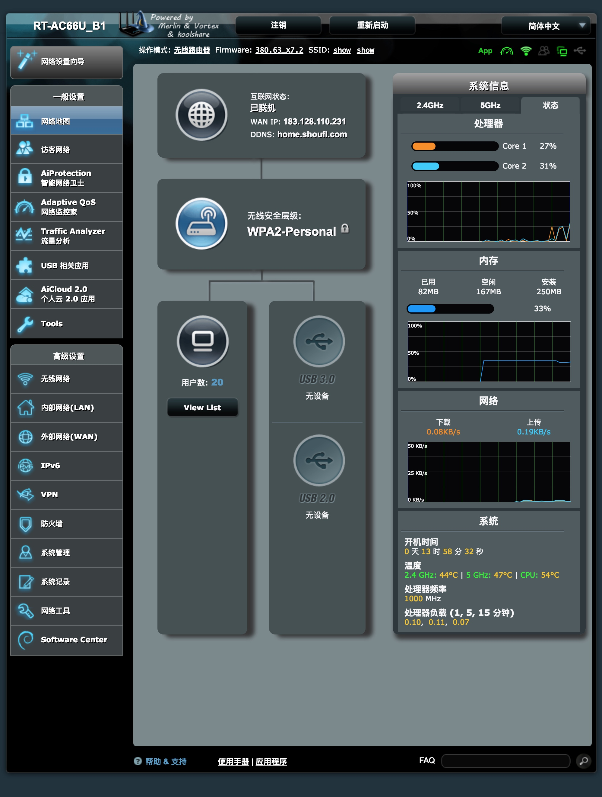
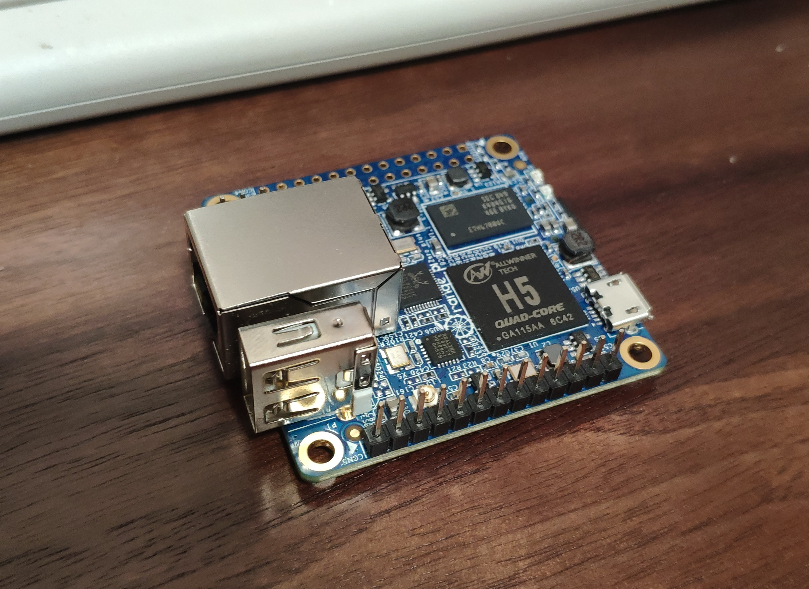
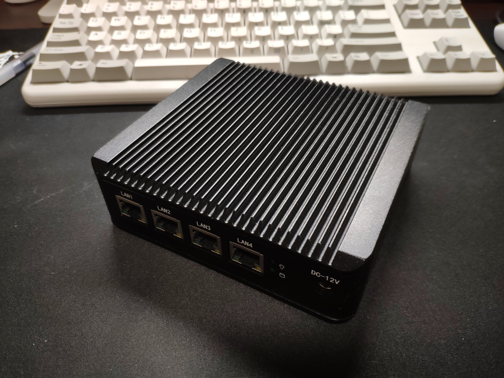
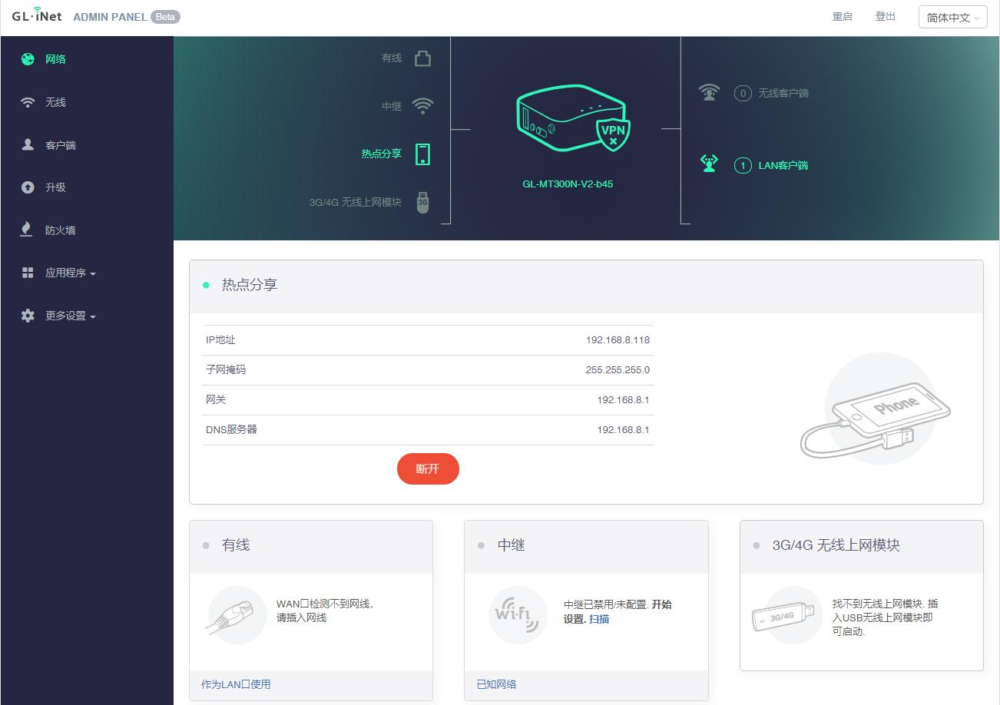

我的智商极限大约就是折腾上网了。

小时候家里没有电脑，跑去表哥家里玩游戏，那时候是拨号上网，联网之后电话就打不进来了，所以妈妈叫我回家吃饭却打不通电话，只能干着急。

后来自己家里也买了电脑，每次开机都要先拨号，总要等好一会儿才行，经朋友指点买了一个路由器，记得是水星的，纯路由器，无wifi。在路由器上进行拨号，比电脑上来得更快。虽然只是进后台填个宽带账号的事情，还是研究了半天。搞明白之后，还跑去小姑娘家里帮人设置，弄好之后我就很老实地回家了。

读大学的时候知道有wifi这种东西，但并没有什么wifi设备，笔记本电脑也是连网线用的，那个时候也不觉得不方便。等到读研究生的时候，移动设备开始依赖wifi了，但学校里上网需要锐捷认证，很蛋疼。看到网上有人说可以把路由器刷ddwrt/openwrt并跑锐捷认证，但是完全搞不懂，最后只能在电脑上插个360wifi来解决，给iPad之类的设备提供无线。后来学校把这类wifi硬件都封了，必须用修改版的锐捷才能正常运行，很难受。最后找导师要了他的Teacher帐号，可以在全校范围内wifi直连外网，感叹技术不如关系好用。

到这个时期为止，还是一名纯小白。

## 折腾的开始

工作后自己租房子住，在淘宝上买了台刷好PandoraBox的小米路由mini，为的是在路由上实现透明代理。买了之后发现这货操作反人类，费了很大劲才设置好拨号，而且不怎稳定，用了一段时间就闲置了。

作为米粉的我又买了大号的小米路由硬盘版，用起来也一般，但好处是能远程下载电影以及自动追美剧，同时学会用samba实现在电视上看路由器里电影。顺带了解了NAS这种东西，研究了一下群晖、Gen8之类的产品，以及HyperV、ESXi之类虚拟技术。

自己买不起群晖，就忽悠单位买了群晖，主要用于企业数据备份和共享，8盘位，raid 5。一开始用QuickConnect来远程访问，很方便但速度不理想。为了能够相对快速地实现远程访问，专门研究了一下ddns，搞了个花生壳的动态域名。然而这其实挺傻的，因为单位的专线其实有公网固定IP。这是后话，不表。

大号小号的小米路由器都不好用，自己又跟风买了Newifi mini，刷完breed后再刷各种固件极为方便。试了一圈发现老毛子固件真好用，相较openwrt直观太多。在路由上设置好酸酸后，所有终端免翻，真是居家越货必备良品。同时可以设置adbyby、KMS等功能，十分强大。顺便在阿里买了个域名，用aliddns可以实现远程访问。

Newifi用起来各种好，然后开始到处安利，并囤积居奇，买了一打放在家里，送给有需要的朋友。期间上门给导师装了一台，设置好酸酸和去广告，导师表示对其科研有很大帮助，并表示要给我介绍女朋友。后来又我开始买已经下车了的K2/K2P，刷好荒野无灯的固件并配置好搬瓦工的酸酸线路送朋友，到手插网线就能用。但因为不可描述的原因，往往用不了太久，我也很难上门去维护，后来便放弃了。几年后发现K2P成了神器，二手市场价格越炒越高，主要是本身硬件靠谱且有各方大神的写的固件，确实好用。

看了网上的放毒文，又买了Asus ac66u b1，刷梅林，感觉上网快了好多。梅林固件有个插件中心，按需安装，独立更新，用起来更方便。这货的最大问题是温度常年70度往上，我经常用它来温一下过于冰的可乐。后来专门给它配了个USB风扇，温度降到50度左右。

顺手把单位里的R8000也刷了梅林，在全所范围内实现酸酸、kms和去广告，自己方便，别人也方便。配合AP，全面覆盖，无缝漫游。有一次内部开会，有个同事说因为在单位可以上Google，查资料方便，所以很愿意加班。老板听了很满意，频频冲我点头，但并没有给我加工资。

最新的梅林固件开始支持AiMesh，于是我又买了一台66u b1，两台共同组AiMesh，有线回程，效果一般。然而某天我突然发现自己其实根本不需要无缝漫游，因为家里实在小，一台K2P完全可以覆盖了，而且发热量还小。遂撤掉两台华硕，收进车库里吃灰。

## 软硬之分

这时我发现科学上网的姿势日新月异，转眼间我已数次换了机场，换了跨栏方案，原本在K2P上刷的固件因为不支持混淆已无法用了，而且性能也跟不上了。于是在终端上想办法，ios用quantumalt，android用surfboard，win用clash，都可以策略组分流。其中clash是我最喜欢的，开源稳定，在PC上用cfw之后几乎再没出过不能上网的情况。

偶然了解到旁路方案，本想把一台闲置的MacBook装上surge当网关用，无奈surge太贵买不起。后来经某TG群安利买了一个orange pi zero plus，和我早年买的树莓派是一个道理，不过这个更小，而且是千兆口，CPU也更强。刷了群里老竭力编译的openwrt固件，支持订阅和故障转移，非常好用。把xbox网关指向Pi就可以实现翻墙，看Netflix速度很棒，和老婆在家看4K的纸牌屋，很开心。

正好电信有免费提速到200M的优惠，就办理了，结果提速后家里测速还是只有100M，问了才知道精装修装的交换机是百兆的，真的垃圾。本想买个千兆交换机放弱电箱，后来转念买了台Newifi3，刷lean固件，拆了外壳后勉强可塞进弱电箱，发热量也还好。将Newifi作为主路由，关无线，挂酸酸乳；K2P使用AP模式，连WIFI；Pi专供Xbox，保证视频速度流畅。

这套方案本身挺合理的，只是裸板放弱电箱还是不放心。某天出差，临时起意买了个四口的J1900软路由。到手后发现做工极好，被动散热效果很不错，夏天也仅40多度。而且大小适中，正好可以放进弱电箱，把新三给换下来。性能上，跑分可以跑三万多，看着就舒服。继续拿K2P作AP，除次卧信号略差之外，稳定又给力。

J1900买来就是刷好了lean openwrt的成品软路由，用了一段时间下来十分稳定。不过人总是要折腾，不时想装装其它的软件包，但是我通过安装编译好的ipk包时总是会出现缺少依赖的情形。更彻底的办法是直接更新固件，但软路由要更新固件却很麻烦，尤其是我的软路由是放在弱电箱里，要拿出来特别麻烦。有一次尝试盲刷，然而固件的lan口与我原先的不一致，最终还是只能拿出来配置，十分蛋疼。

更科学的方法是虚拟化安装，但J1900这块CPU不支持网卡直通，故不考虑。转而用那台刷了小钢炮的N1测试了docker安装op，确实很方便，更新固件只需要pull一下最新镜像，远程配置一下即可，而不必去动机器本身。

虚拟化安装是更科学的系统安装方式，打算以后有机会再换个软路由，比如3865U之类。网上看到还有一种思路是先PVE虚拟化后，跑一个Openwrt，再跑一个Linux定期pull最新源码并编译后自动更新Openwrt，这个操作太骚，学不来。

Pi暂时闲置了，作为测试clash的机器。clash及luci clash尚处于测试阶段，有一些小毛病，不如终端上的版本稳定。最新版本clash上开始引入fake-ip模式，但我并没有搞懂，大约就是防DNS污染的一种方法。不过旁路其实没必要跑openwrt，不如直接armbian跑clash并设置iptables转发规则到clash更为简洁，尤其是clash更新tun模式之后，理论上速度也更快。

某次心血来潮翻出早年买的一个小黄路由——GL MT300N V2，在吃灰多年后，经更新固件终于可以支持华为4G网卡，插上即可上网。其固件本质为openwrt，套了个一定制的界面。然而并没有想到可用的场景，就当玩玩吧。

## 远程访问

老竭力的Argon主题真好看，时不时打开路由管理界面看看。为了能远程看到家里的网络情况，打电话给电信改了桥接，然后用主路由PPPOE拨号，并在阿里云买了一个域名，用于ddns。这个操作看起来并没有什么卵用，但实际上打开了一扇大门。

实现远程访问后，在家里搞了一台蜗牛星际跑黑群（矿渣真香）。用cloudsync来下载百度盘和Google Drive上的资源（cloudsync真是神器）。

在群晖上跑docker也很不错，跑了clash和[gost](https://docs.ginuerzh.xyz/gost/)，后者是一个转发代理的工具，可以实现将连到这台nas的特定流量转发到clash，从而实现代理中转，有一定用处。

然后搞了更的远程服务，包括下载、媒体库等，详见本站其它文章。

## 说说clash

最终还是说回clash。在2019年这一年里，眼看着clash这个开源软件一步步走向全平台（iOS除外），我现在电脑、手机、路由器、NAS都是用Clash了。再次感叹开源社区的强大，在Dreamacro写了Clash内核后，又有各路高手写了各平台的UI，各有特色，比如cfw/cfa都是很棒的软件。

除各平台UI程序外，因为clash配置相对复杂，又有人写了转换程序，可以把服务商的订阅转换成自己喜欢的配置并可以自动更新。我主要用来转普通订阅为node list，然后通过proxy-provider更新。

此外，还有一个clash的web管理界面，我也很喜欢，方便查看实时网速、流量以及日志等。

但开源社区也有一些不那么舒服的事情。今天碰巧看到一篇[文章](https://github.com/JadaGates/ShadowsocksBio)，让人唏嘘不已。很多事情在clash上[重演](https://github.com/JadaGates/ShadowsocksBio/issues/6)，历史总是惊人的相似。

clash在2020年6月27日突然把版本号拉到1.0.0[版本](https://github.com/Dreamacro/clash/releases/tag/v1.0.0)，这意味着开源时代的结束。此后clash将另开一个premium的闭源版本，支持rule-provider、tun、script等新功能。此举封死了clashr无脑抄代码的路子，但也堵死了开源合作的可能性，只剩为数不多的开发者参仍与其中。对于使用者而言，目前来看影响不大，clash的开源版本已经更新了proxy-provider这个重要功能，配合subconverter进行节点更新十分方便，未来小修小补可能还是会有更新的。我在服务器docker里跑了1.0.0版本，使用良好。

7月22日，clash作者合并了关于支持酸酸乳协议的[PR](https://github.com/Dreamacro/clash/pull/805)，另人纠结的clashr正式退出历史舞台。不过这个PR最终被cherry-pick到premium分支，提这个PR的作者不但水平很高，而且挺无私。

我现在属于拿来主义，只会拿开源社区的东西来用；希望以后也有能力可以去提pr甚至自己写个有用的程序，也为开源社区作点贡献。

## 家用简化

传说中最小的软路由R2S出了官方金属壳，赶紧买了一个，手感真的好，和Orange Pi摆一起，像一对艺术品。相比之下J1900真是庞然大物，换了。

利用Github Action自动编译了固件，烧到TF卡也十分简单。这大约是最简单的软路由方案了吧。

AP方面，原本计划用Velop mesh ap，后来觉得实在是贵，消费降级，买了最便宜的水星mesh路由，两只的价格不到200，用起来效果也不错。参数上，wifi5略落后，2.5Ghz+5Ghz总共1200M的带宽也无法完全跑满千兆，TP的那款mesh路由其实更好，但我更想要白色的，好看些。这比当年用华硕的Aimesh强多了，回头看华硕的路由器实在是有些坑，但在那个时期人人奉为神器，人的局限性真的很大。

基于以上经验，推荐一般家用（200M以上带宽且有网线布线的）可以考虑：R2S + 交换机 + [TL-WDR7650](https://www.tp-link.com.cn/product_1368.html)的方案，500元以内的实惠选择。

## 进一步简化

使用下来Openwrt总体是稳的，但由于我手贱总会去升级下或者改个什么设置，最终导致出现问题，必须再次打开弱电箱处理。在第N次打开鞋柜里的弱电箱后，我终于放弃了折腾，决定进一步简化上网方案，改为普通路由器+旁路的方案。由于并不是家里所有设备都需要代理，个别设备指定旁路的网关的方式显得更为科学，对整体的影响最小。

选了号称弱电箱神器的UBNT ER-X作为主路由，以小巧和稳定著称，确保以后再也不必打开弱电箱操作。这台机器到手后给我惊艳的感觉，真的只有巴掌大小。

其复杂的功能界面让我研究了半天，而且这个机器竟然没有自带说明书，大约是太复杂以至于说明书印不下吧。最终都设置好了，但我其实并没有搞明白细节。

然后用N1跑了小钢炮系统，并虚拟出一个Openwrt，同时作为PT下载机和旁路由使用，性价比极高。

## 结语

我感叹网络技术真是深不见底，越到底层我越搞不懂，这大约是我智商的极限了，如果有空我得去读一读TCP/IP，了解一下底层原理。不过这种软硬结合的玩法真的有趣，我已然将其视为一种乐趣，而超过实现科学上网功能这一初衷。

这一感觉和网友[@cxiaoji](https://twitter.com/i/web/status/1126165698978271232)说的很像：
>我对数据结构有非常美好的回忆。我真正开始理解编程就是在贵系蹭的数据结构课。老师没打开过教材，上课就一个编辑器，从头写一个类，一边讲一边往里面添方法。讲完编译，测试，通过，正好下课。我期末要熬图根本没工夫复习的，但是这门课学的东西一点都没忘。