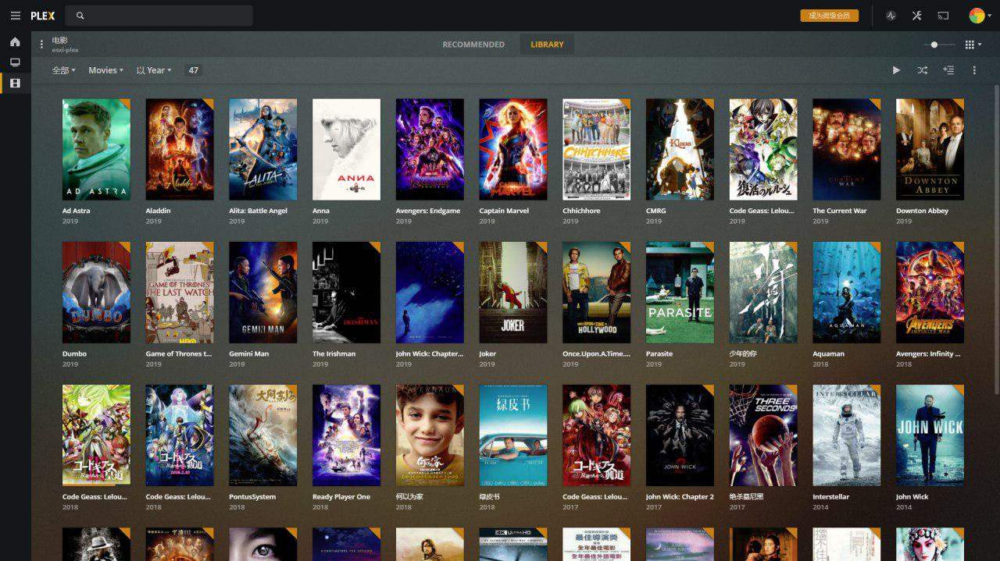
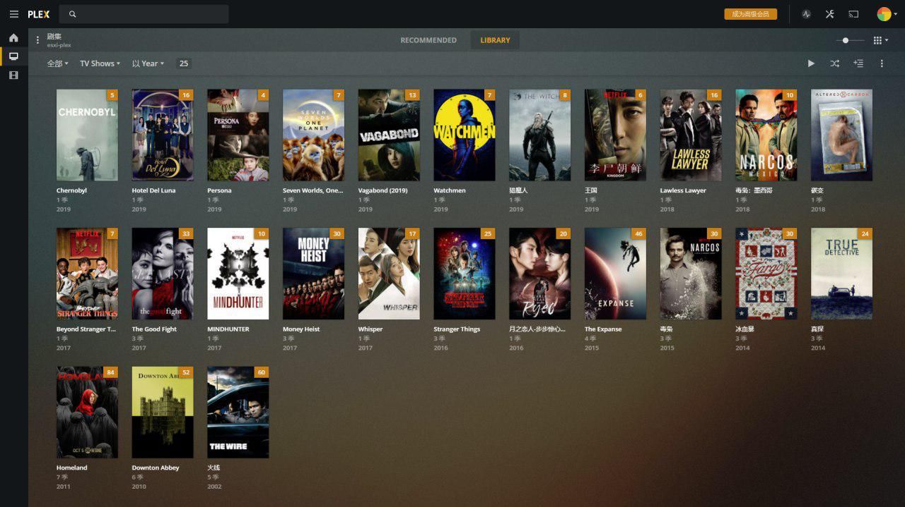

大约从大学起开始看美剧，跟风看老友记、越狱什么的，主要是从学校的ftp下载，或者从同学那里拷贝。后来有了Maze，下载更方便一些。后来发现别人看完都去考GRE出国了，都是带着目的去看美剧的，就我是在那儿瞎JB看。

研究生阶段主要看冰与火、纸牌屋为主，同时开始看韩剧，城市猎人、星星的你之类。主要通过人人影视等渠道去下载，迅雷下到电脑上，几个室友一起看。

毕业后买了一个小米电视盒子，以及一台小米路由硬盘版。这个路由可以自动追剧，喜欢的剧会自己下载下来，非常方便。然后用盒子可以直接SMB访问路由看，自动匹配字幕。非常给力。主要看了疑犯追踪，这剧太长了，追到后面实在有些累。

后来整体升级了一下，买了sony电视，买了Netflix会员及原生线路，买了Xbox（有NF支持），以及Sonos 5.1 全家桶。这么大的投入效果确实非常好。不过工作也忙，很少有时间看，一般只能看短剧，比如碳变、爱死机、黑镜之类。有段时间老婆回娘家，我一口气看完三季《怪奇物语》，非常痛快。由于音效过于逼真，此片又过于cult，看的时候吓得不轻。

赶上黑五的时候又买了Firestick 4K，接房间的小米电视，十分小巧可以藏在电视背后，从正面完全看不出来。而且这货可以用Alexa来控制，装逼效果一流，实际没啥用处。不过我慢慢失去耐心，一般剧都看不过三集。

Netflix虽好，但上面还是有很多片子是没有的，所以有时还是需要本地片源，原先用的小米路由器硬盘版太弱，便上了群晖。群晖上cloudsync堪称下载神器，可以以同步的方案下载百度盘、Google Drive上的资源，这俩是目前最主流的资源分享渠道了。对于种子或是磁力，也可以通过其自带的Download Station来下载，速度一般。

然后为更流畅地看本地4K片源，又买了一个N1，刷coreelec（kodi变体），观影效果很棒。

不过老婆嫌NAS太吵，家里太小没办法只能搬去单位，SMB方式变得不可行。后来偶然了解到还有Plex这样的神器，可以远程流媒体传输。群晖上有现成的套件就直接跑了一个，也很简单。我最喜欢Plex之处在于任意设备直接播放，并且保存播放记录多设备同步。此外，其自带的刮削器也很强，片子的信息基本都能正确地抓到，效果如图：

这是我当年很喜欢的美剧《冰血暴》，存在NAS上，偶尔看看介绍也是蛮好的。

不过这货要实时转码，很吃CPU，于是又改而跑在另一个强一的点服务器上。

折腾了那么多，看剧的时间是越来越少了，忧伤。