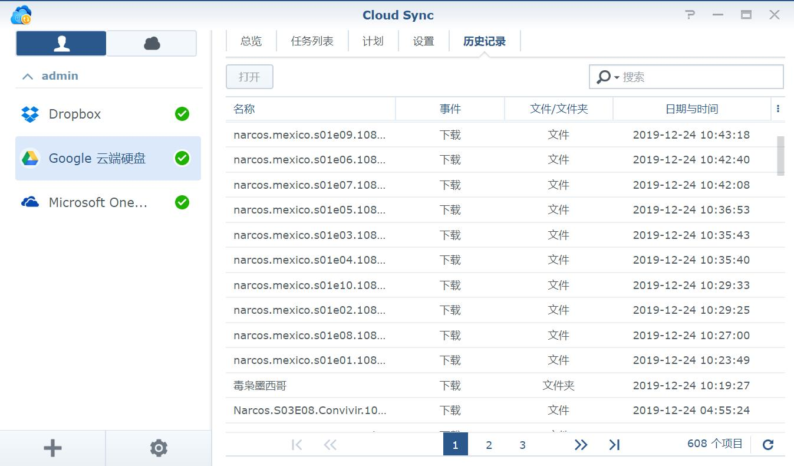

大约从大学起开始看美剧，跟风看老友记、越狱什么的，主要是从学校的ftp下载，或者从同学那里拷贝。后来有了Maze，下载更方便一些。后来发现别人看完都去考GRE出国了，都是带着目的去看美剧的，就我是在那儿瞎JB看。

研究生阶段主要看冰与火、纸牌屋为主，同时开始看韩剧，城市猎人、星星的你之类。主要通过人人影视等渠道去下载，迅雷下到电脑上，几个室友一起看。

毕业后买了一个小米电视盒子，以及一台小米路由硬盘版。这个路由可以自动追剧，喜欢的剧会自己下载下来，非常方便。然后用盒子可以直接SMB访问路由看，自动匹配字幕。非常给力。主要看了疑犯追踪，这剧太长了，追到后面实在有些累。

后来整体升级了一下，买了sony电视，买了Netflix会员及原生线路，买了Xbox（有NF支持），以及Sonos 5.1 全家桶。这么大的投入效果确实非常好。不过工作也忙，很少有时间看，一般只能看短剧，比如碳变、爱死机、黑镜之类。有段时间老婆回娘家，我一口气看完三季《怪奇物语》，非常痛快。由于音效过于逼真，此片又过于cult，看的时候吓得不轻。

赶上黑五的时候又买了Firestick 4K，接房间的小米电视，十分小巧可以藏在电视背后，从正面完全看不出来。而且这货可以用Alexa来控制，装逼效果一流，实际没啥用处。不过我慢慢失去耐心，一般剧都看不过三集。

Netflix虽好，但上面还是有很多片子是没有的，所以有时还是需要本地片源，原先用的小米路由器硬盘版太弱，便上了群晖。群晖上cloudsync堪称下载神器，可以以同步的方案下载百度盘、Google Drive上的资源，这俩是目前最主流的资源分享渠道了。对于种子或是磁力，也可以通过其自带的Download Station来下载或是用Docker跑个aria2，速度一般。

然后为更流畅地看本地4K片源，又买了一个N1，刷CoreELEC（kodi变体），观影效果很棒。

因为我这台N1没有配遥控器，但按理可以CEC解决，但不知为何一直不成功。后来查到一篇[文章](https://post.smzdm.com/p/738281/)才知道导致hdmi cec失效的元凶原来是电信的机顶盒，真是万万没想到。于是拆了一个头并且剪了一根线，解决了这个问题。

不过老婆嫌NAS太吵，家里太小没办法只能搬去单位，SMB方式变得不可行，改用webdav。后来偶然了解到还有Plex这样的神器，可以远程流媒体传输。群晖上有现成的套件就直接跑了一个，也很简单。我最喜欢Plex之处在于任意设备直接播放，并且保存播放记录多设备同步，相当于自己跑了一个爱奇艺。此外，其自带的刮削器也很强，片子的信息基本都能正确地抓到，效果如图：

这是我当年很喜欢的美剧《冰血暴》，存在NAS上，偶尔看看介绍也是蛮好的。

不过慢慢发现Plex实时转码是很吃CPU的，J1900这块CPU的性能根本吃不住，瞬间跑满。网上建议改为串流，终端解码，于是在电视上装了Kodi，然后再装Plex插件，但实际操作时要先进入Kodi再从插件中启动Plex插件，类似app套娃，体验不佳。进一步了解到Jellyfin插件，与Kodi结合更深，将影片信息直接同步到Kodi里，打开Kodi就是影片墙了。

试着放了一下4k的片子，确实更流畅，而且群晖CPU并没有显著变化。

Jellyfin作为开源免费软件，功能上并不输Plex，我更喜欢Jellyfin的一点是它不需要像Plex那样要过Plex服务器认证后才能连接，直接远程连接到自己服务器即可，更为自主可靠。此外，Jellyfin无须付费就支持硬解，我试了在配置硬解后网页直接播放，CPU降至50%左右，还是有些勉强。

Jellyfin+Kodi的方案，相当于就是把Jellyfin作为影片管理器来用了，其刮削器匹配的影片信息，准确度也很高。此外，通过插件下载字幕，也十分方便。

不过Jellyfin在匹配同一部剧的不同季的海报上似乎有bug，永远都是用同一张海报。为了解决这个问题，改为跑Emby，则完全没这个问题。Emby可以看成是Jellyfin的付费加强版，和Plex相比各有优劣，价格差不的情况下，我还是选择Plex，在刮削、字体等方面更为省心。

由于我NAS的CPU太垃圾，使用Plex+Infuse Pro的组合体验会更好，同样是Plex作为影片管理器，Infuse作为播放器，UI很舒服，操作也很人性化。通过Apple TV来播放，应该算是最佳方案了。

平民方案还是用Jellyfin，另选择用N1刷CoreELEC后装Jellyfin看。买了一根usb转dc的诱骗线，用小米电视的USB口供电并假装自己是12V从而成功带动N1，这样就免去再接一根电线的麻烦。同时因为有CEC支持，所以可以直接用小米遥控操作N1。N1完全隐在壁挂电视背后，非常完美，这个配合堪称最佳实践。

十分喜欢N1这个小盒子，于是又买了个，刷了小钢炮系统用于下载，荒野无灯出品，找到了当年用他的老毛子路由器固件的感觉，十分简洁直观。

在N1上插个不用的移动硬盘，使用系统自带qBittorrent来下载些蓝光电影，本地观看，速度更快，也没噪音。

用了一段时间发现Kodi的操作界面还是有些反人类，比如按返回键并不会暂停播放，只是返回到上一级菜单同时背景在继续播放。另外，看完一集后要隔一小会儿才能在主页显示下一集，都不怎么顺畅。还是换回在服务器上跑媒体库的方式吧。既然已经试过Plex和Jellyfin，这次就试度Emby。用起来的感觉和Jellyfin差不多，但没有Jellyfin的字幕乱码等问题，还是挺完善的。但是刮削依然不及Plex智能，还是经常需要人为干涉的那种。但总体瑕不掩瑜，跑了一个在我的新NAS上，这台NAS有CPU有HD630核显，用来跑硬解完全没问题。这大约就是终极方案了。

然而折腾了那么多，看剧的时间是越来越少了，有点忧伤。为什么还要折腾，大约是一种情怀，有一位[推友](https://twitter.com/piece/status/1230364853610483713)说的很符合我的心境：
> 昨天花了很长时间折腾IPTV，想抛弃电视盒子在家随意观看，什么双线双拨，什么VLAN都尝试过，家里的网搞瘫两次，一直搞到今天凌晨三点也没成功。其实我不看电视，也不闲，甚至还有点忙，就是啥正事也不想干，就想把精力耗干，每隔一段时间就会来一次，啥也不想干。