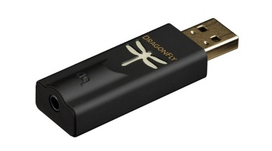
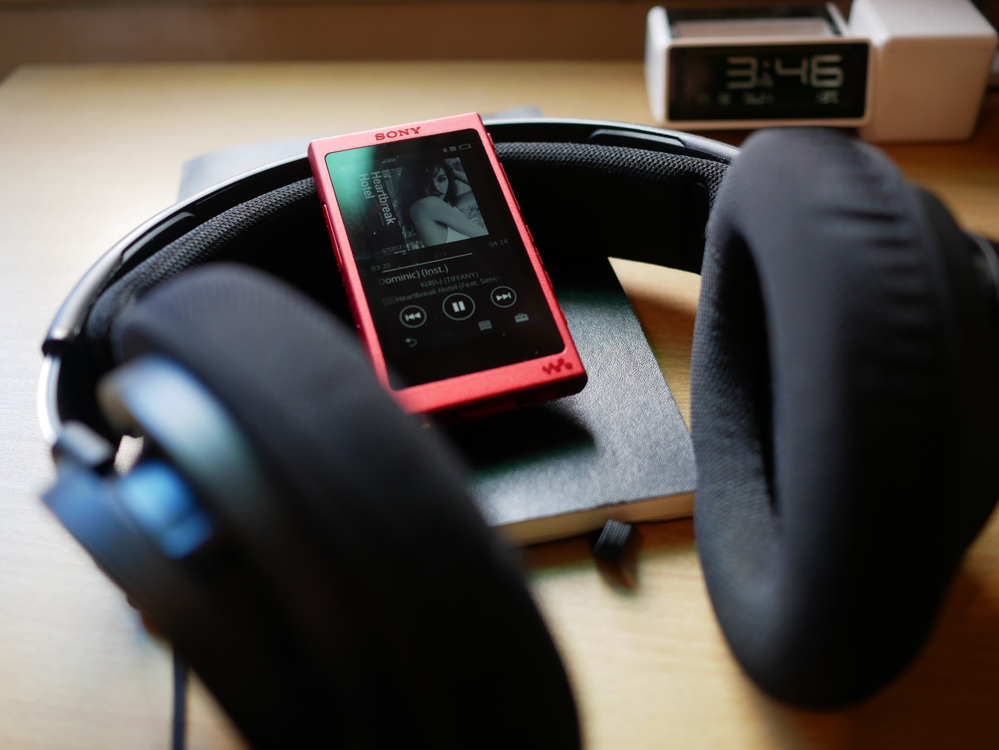
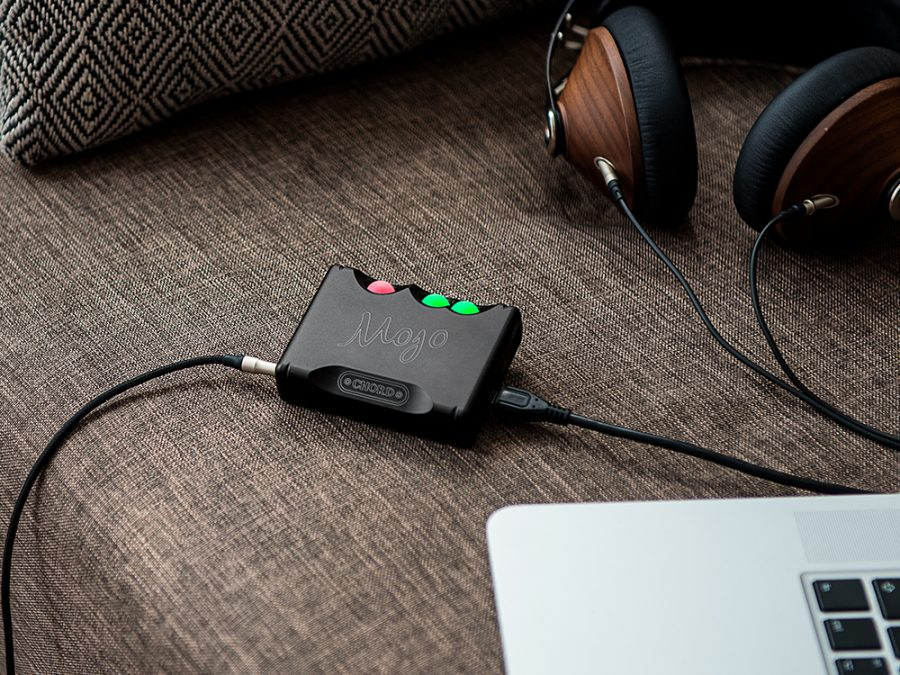
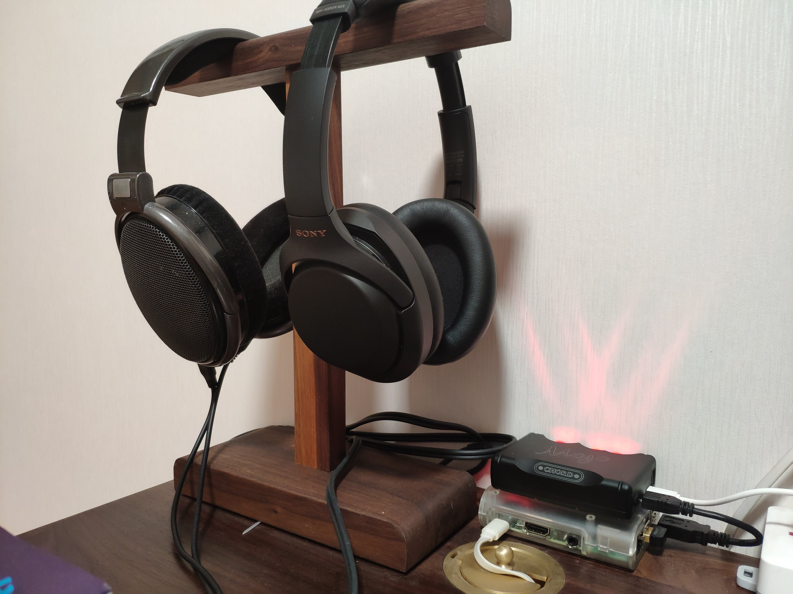
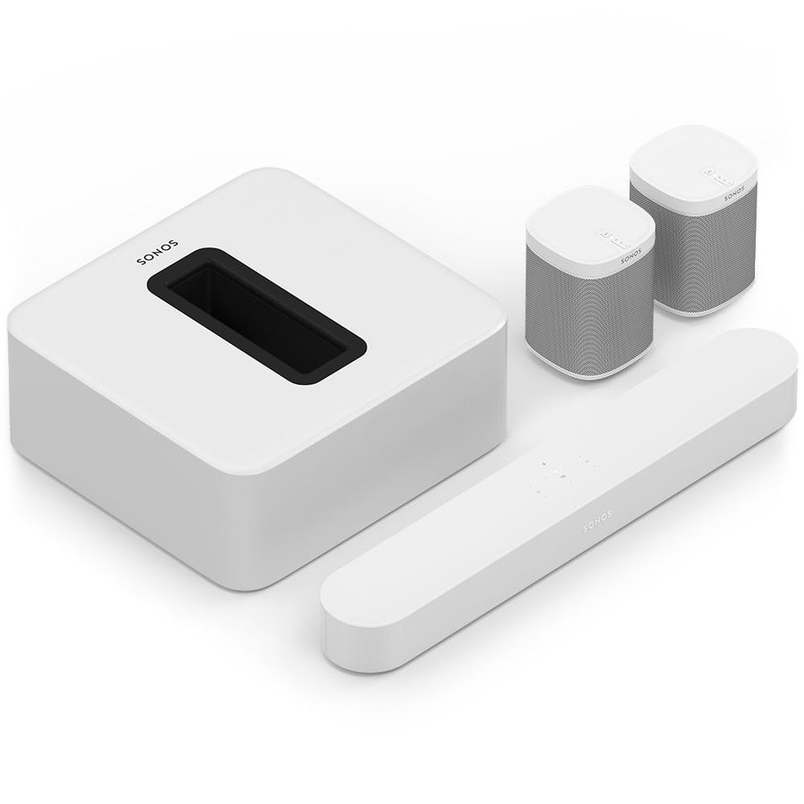
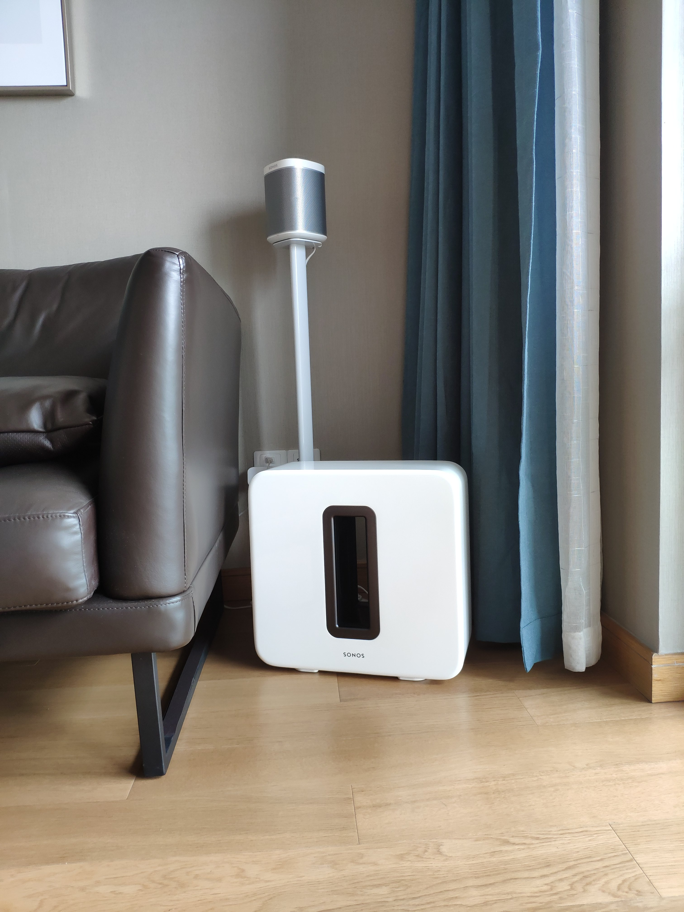
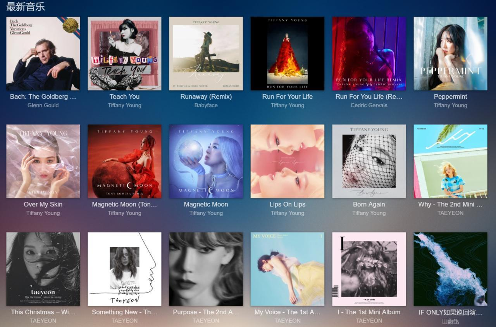
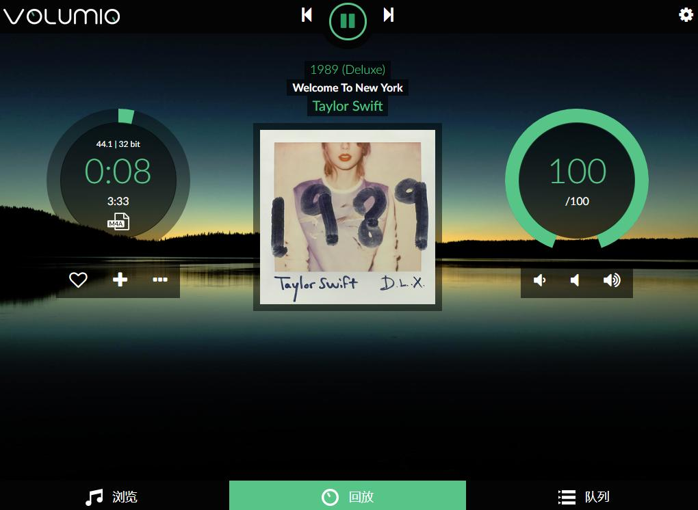
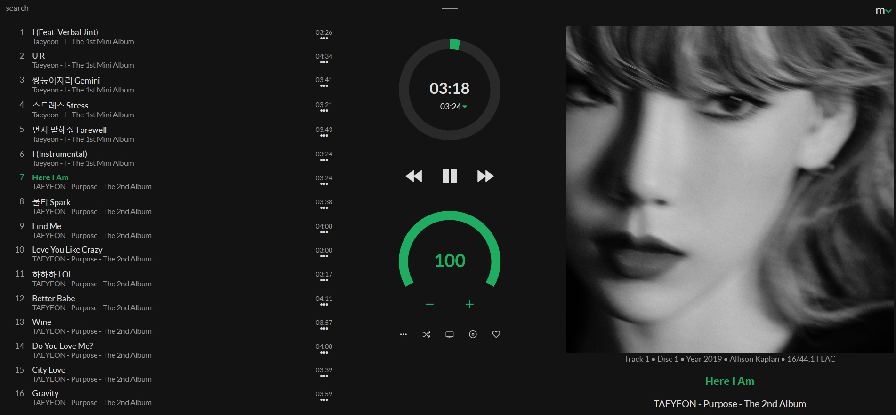
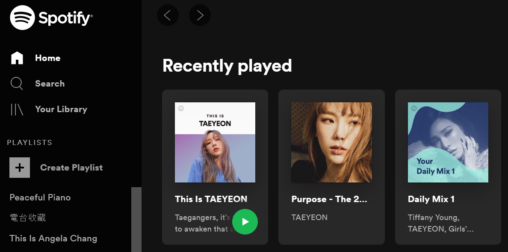

大约从初中那会儿开始喜欢听歌，那个时候很淳朴（穷），买一盒磁带，放在步步高复读机里。那时最喜欢听谢霆锋，因为觉得他叛逆，粤语摇滚，歌也确实好听。那个时候因为整天听复读机，给家人造成了我英语听力很好的错觉，但其实只有粤语听力水平进步了。

高中继续听谢霆锋，后来又增加听萧亚轩、周杰伦，都是当时极红的歌手，磁带都是同学间互相借。因为看到大家都用上了索尼、松下的随声听，卡带机为主，也有富家子弟用CD机、MD机的，于是缠着老妈要买一个。终于在某次考得不错之后，妈妈给买了。结果我太兴奋，上来就弄坏了，又拿去修，挺折腾。那时候买这么一个机器还是挺贵的，现在回想有些过份。

大学时老爸给买了一个MP3，好像都没有牌子，但我还是听得很开心。去学校机房拷歌，下载各种乱七八糟的，晚上被窝里听，那个时期最喜欢张韶涵、陈绮贞。其实那个时候手机也可以听歌了，还可以通过Mzone下载，算是很先进了。开始知道音质好坏的差别，听过朋友的iRiver播放器+PX100耳机我都好喜欢，可惜买不起。自己用的，还是学校报亭里买的廉价耳机。

研究生期间开始听少女时代，因为听不懂歌词，比较好集中精神。这个时期开始追求音质，开始物色好一点的耳机、耳放等，记得第一次海淘就是为了买Dragonfly DAC。等了一个月，天天刷物流，到手之后却没有什么特别的感觉。不过这个USB DAC在别的场景下发挥的作用，远超过其带来的音质，一个是之前用电热毯的时候听歌会有电流干扰，用了这个DAC后就不杂音了；另一个场景是晚上看电视声音大影响家人，想用耳机外接但家里的电视机没有耳机孔，最后通过USB口转接来实现，解决了这个问题。

工作之后开始有点小钱了，买得更多，买过的耳机类产品我都记不清了，基本都是看评论好买来，听了一下没啥提升就二手卖了，纯粹是瞎折腾。后来我发现，因为我都是听K-POP，这类曲风其实很难听出音质差别。这期间还买过一个索尼的播放器，同样没啥音质提升，不过样子好看，我很喜欢。

后来索性按好看为主、便利为辅、兼顾参数的思路，去买产品，断断续续又买了Mojo耳放、HD650耳机、GR09耳塞等，都是不俗的产品，音质也确实有些提升，但也就那样，这算是真正对设备退烧了。

---

然而我把设备想简单了，其实还有更多细分品类，比如降噪耳机以及音箱等。在选购时还是以好看为首要因素。

降噪类买了Bose QC25、大法1000XM3、AirPods Pro，都是很好的产品。尤其是AirPods，这个产品开创了真无线耳机这个新品类，非常好用，我把一代、二代和Pro都买了，特别喜欢Pro，通勤降噪太有用了，只是戴时间长了耳朵会疼。家里则更多用大法，还专门买了个耳机架，和HD650摆一起。

音箱类呢，买了Sonos。起因是早年尝鲜买过一个Sonos Play1，听着喜欢又买了一个组双声道，然后又买了Sonos Beam，然后……直到买齐了全家桶。

Sonos的主要特点就是简单易用，可以在线播放Spotify、Tidal、网易等各种音源的歌（还可以语音控制）；电视打开的时候，就会自动切换到电视音源，5.1声道看Netflix不要太爽；还有很重要的一点是好看，放在沙发边上，很和谐。

---

说到音源，这个也经历了一番折腾，尝试过自建曲库，放到NAS里，用Audio Station来管理，不太理想。改为用Plex/Jellyfin组织，也没啥意思，只能图个好看。

又试了树莓派刷Volumio等进行管理，科技感很强，实际用起来并不方便。

moOde用起来体验相对好些，因为树莓派闲置，就跑了一个，偶尔听听。

最方便还是在线曲库，先后试了Spotify/Tidal/Youtube Music等，实测还是Spotify最强，曲库最全，算法最优。为了Spotify还上了Spoticheap这条贼船，交了一年的费用，没多久就翻车了，难受。还是在Telegram上找个合租吧。

---

最终回归本源还是在于听什么。年纪渐长，少女时代那种蹦蹦跳跳的再也不喜欢了，但是依然喜欢成员里独立发唱片的Taeyeon、Tiffany，每次出的歌还是质量很高。但是听多了会觉得心烦，慢慢开始听古典，常听巴赫[哥德堡变奏](https://open.spotify.com/album/1aCpHSQE5ghxibsQ5gkBe0)，能够平复心情。

所谓科学听歌，其实没有任何需要科学的成份，只要听自己喜欢的，就行了。