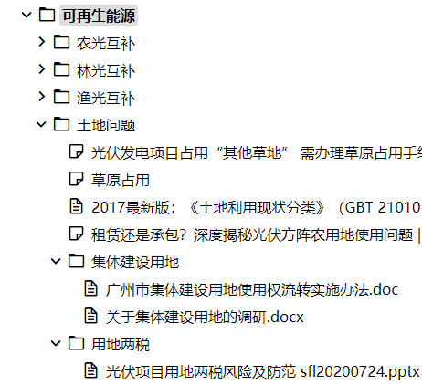

写笔记似乎很简单，但也是一件可以折腾的事情。我读书的时候基本不写单独的笔记，教材上重点内容划线，旁边再写两句就好，实践证明也十分有效。真正开始琢磨笔记的写法是在电脑上写笔记之后，笔记的电子化之后最直观的改善是便于检索了，但又远不止这一点好处。

## Evernote
对于笔记软件的尝试始于Evernote。大约是2008年的时候从善用佳软的网站上看到推荐，记得那个时候还是个连中文搜索、笔记同步都还没有的很初步的软件，但出于尝鲜的想法，下载了一个试试，似乎挺不错，直观感觉是一个可以像word一样编辑的软件，写东西可以不用新建一个word，很方便。

后来Evernote的功能越来越完善，也更加喜欢用。Evernote推出收费机制后，开始付费使用。有一度非常痴迷Moleskine，经常海淘买Moleskine与Evernote的联名款笔记本，每一本附3个月高级账号。现在回想真是情怀。

# Vim
用Vim也是因为看了善用佳软的推荐，纵然学习曲线陡峭，但是坚持用下来了。通过Vimwiki插件写笔记及日记，笔记与日记相关联，各种内部链接，亦即wiki的逻辑。用Vimwiki写日记的习惯保持了十年，后来人到中年，顾不过来了，就中断了。

BTW 在善用佳软的推荐下，除了Evernote、Vim之外，还有两件对我有重大影响的：五笔、TotalCommander。

## 印象笔记
Evernote进入中国后开了小号，相当于开了一分支，叫做印象笔记。印象笔记的好处是与Evernote所有功能一致的情况下，同步飞快。那个时期正好是我步入工作岗位的时候，于是把工作相关笔记全部写在印象笔记里，多终端同步，非常舒适。同时我开始运用Vimwiki中学到的内链，不仅仅是无脑收录，更注重笔记间的关联。

在印象笔记与Evernote正式分家，独立运作之前，这个笔记还是非常好的，我一口气续了十年的高级账号。后来印象笔记完全中国运作，也开始和国内某些服务商一样开始恶心人。先是推出了高级账号以上的专业账号，这个我还是买单了。后来发现即便是专业账号，也还是会看到广告，这就有些蛋疼了。再后来逐渐加了各种功能，越来越臃肿，以至于打开一则笔记要卡半天，完全失去了初衷。更新出的东西华而不实，使用逻辑越来越复杂，垃圾。

于是我退回到了一个很老的版本，是印象笔记为了兼容XP专门放出的，大约是最后一个响应快速、没有广告的桌面。鉴于我在印象笔记里已经有一万多条笔记，完全放弃也很难，打算就这样一直用下去，同时找找新的替代品，等服务到期后，我想我是不会再续费了。

## 为知笔记
印象笔记表现出流氓姿态后，开始试用其它笔记，找了一个国产的为知笔记。为知我一开始用了免费版，同时内购了iOS的同步IAP，用起来也不错。但很快为知也流氓了，关闭了免费用户的同步功能，我买的内购也就白买了。不是说收费不行，但给人的体验极差。

## Notion
非常火的一个在线笔记，首次提出了块的概念。我在第一时间搞了一个永久账号，但用下来不得要领，似乎更适合作为信息发布功能来使用。因为国内网络的问题，用起来也不流畅，先放着吧。

Notion大火之后，被一顿抄。国内的在线笔记几乎都有抄Notion的痕迹，比如某钉、某书。其中某书抄得还是很到位的，功能上更为丰富，协同很棒。但访问速度还是跟不上节奏，还是有些卡卡的。

## Joplin
所以笔记还是得本地才行，无网络也能用，而且速度也更快。同步也不能少，有多终端使用的需求。所以开始找可以自建同步服务的笔记软件，一开始试了为知的docker版，我在群晖上试了一下，确实可以同步，但这个自建方案还是有账号限制，蛋疼。

后来了解到Jolpin是一个开源的，且支持内置webdav同步的笔记软件，所见即所得编辑器，不错的剪藏插件，而且有手机端app，可以说是印象笔记的完美替代品。试用了一下挺不错，但同步起来似乎有些小问题，就没有深入使用。不过后来Joplin又提供了新的同步方案，有机会再试试。

## Obsidian
2020年前后，笔记界迎来了跨时代的重大更新：反向链接。或称为双向链接，也就是在A笔记中插入B笔记的链接，同时在B笔记的阅读界面自动提示有A笔记及其它笔记引用了B笔记。

笔记内部链接其实很早就有，比如我早年用来写日的vimwiki，就有非常方便的wiki式内部链接，对于建立知识库非常有用。反向链接把这一好处进一步放大，能直接生成知识地图，这似乎是Roam Research的首创，我不太确定是否有更早的来源。

双链时代下我首先用的是obsidian，很直观也很好用，源文件全部markdown格式保存，非常友好。而且支持插件，各种花样功能，比如自动git pull和push很实用。比较遗憾的是缺少实时渲染的编辑器，还是编辑、预览分离模式，而且这个功能需求提了很久很久还是没更新，开发节奏偏慢。

## 思源笔记
为了实时渲染的编辑器，又试了思源笔记，编辑器很好用，而且本土化很好，比如可以用中文【【来引导插入内链，非常方便。同步必须用官方服务，而且同步逻辑很蛋疼；但是也可以用其它同步软件同步本地文件后使用，所以也还可以接受。充值了一年的费用，作为支持，看看后面的发展吧。

## logseq
偶然看到有人推荐logseq，就下载试用了一下，当时正在测试金丝雀版本，还有很多问题。但是logseq让人眼前一亮，让我意识到原来笔记软件也是可以用来GTD的。进一步深入用了一个多月时间，觉得logseq非常棒，可以说是一个集笔记与日程管理于一体的软件，兼有一定项目管理的效果。我喜欢这个工具是因为它与我的工作流非常匹配。

对于大部分打工人来说，搞个小便签记录一下工作事项是一种普适性工作流。每天的工作事项基本是客户或上级安排过来的，很少有基于项目管理的任务分解而形成的任务。这是大部分项目管理工具的误区，认为所有任务都是分解而来。流水账之外，还是有项目管理及时间管理的要求，需要记录自己有哪些项目在办，以及近期有哪些既定的日程安排。

logseq的默认界面，正好暗合了这一工作思路，左边是流水账，右边可设置为项目列表及日程表。当流水账与项目关联起来，就具备了项目管理的基础，即对工作事项的回顾，有无偏离，有无需要补正的。这是反链的好处。

不过logseq目前还处理比较前期阶段，还有很多功能待完善，比较急需的还是同步，目前借助git来实现同步总会有一些问题，需要经常re-index之后才能正常显示，有些头疼。

## Trilium
在试用了那么多笔记软件之后，大概是明白自己需要什么。总结一下就是：
- 有内置同步服务且同步服务可以自部署
- 有所见即所得的编辑器
- 有任务管理功能
- 有双向链接
- 有网页剪藏

想了很久想到之前在跑unraid时曾用过一次Trilium，当时嫌太丑，没用下去，但基本满足以上要求。于是又在服务器上跑了一个，同时在电脑上装了客户端，两者配置好同步。

再次使用发现依然有些难用，这个界面就非常不友好，部分功能通过脚本来实现，而脚本竟然是直接写在笔记目录下的，很神奇的逻辑。但一旦接受这个设定之后，就开始觉得好用了，尤其是无限层级笔记功能，一开始没理解，真正用起来之后发现非常棒，再次刷新了我对笔记的认识。

印象笔记是没有层级的，准确的说最多三层，笔记本组、笔记本、笔记。在Trilium下，我可以随手写一则笔记，其中为了解释其中一个概念，新建另一则笔记具体展开，这个笔记中引用了某篇文献作参考……可以无限细分下去，同时又能一眼看出其中的逻辑关系。

与无限层级笔记配套的功能是clone，打破了层级的限制，使得所有笔记都是同等地位的。比如就网页剪藏而言，我原本以为印象笔记是剪藏是最完美的，会自动判断相似性并放到其认为最匹配的笔记本里，通常都挺准的，非常牛逼。Trilium则是直接放到当日笔记下，作为当天的收录；对于有明确目的性的笔记，可以clone到合适的笔记下；A笔记被clone到B笔记下之后，A笔记会自动嵌入到B笔记的底部，相当于参考文献的概念。

目前来看，Trilium的界面相对较为简陋，后面会有UI大改计划。双链功能偏弱但也基本够用，没有块引用我觉得也无所谓。同步飞快，剪藏效果也不错，总体很满意。

## 结语

所以大约会固定下来使用Trilium，只要不出大bug。记一下时间，始于2021年6月11日，后面回头再来看看。