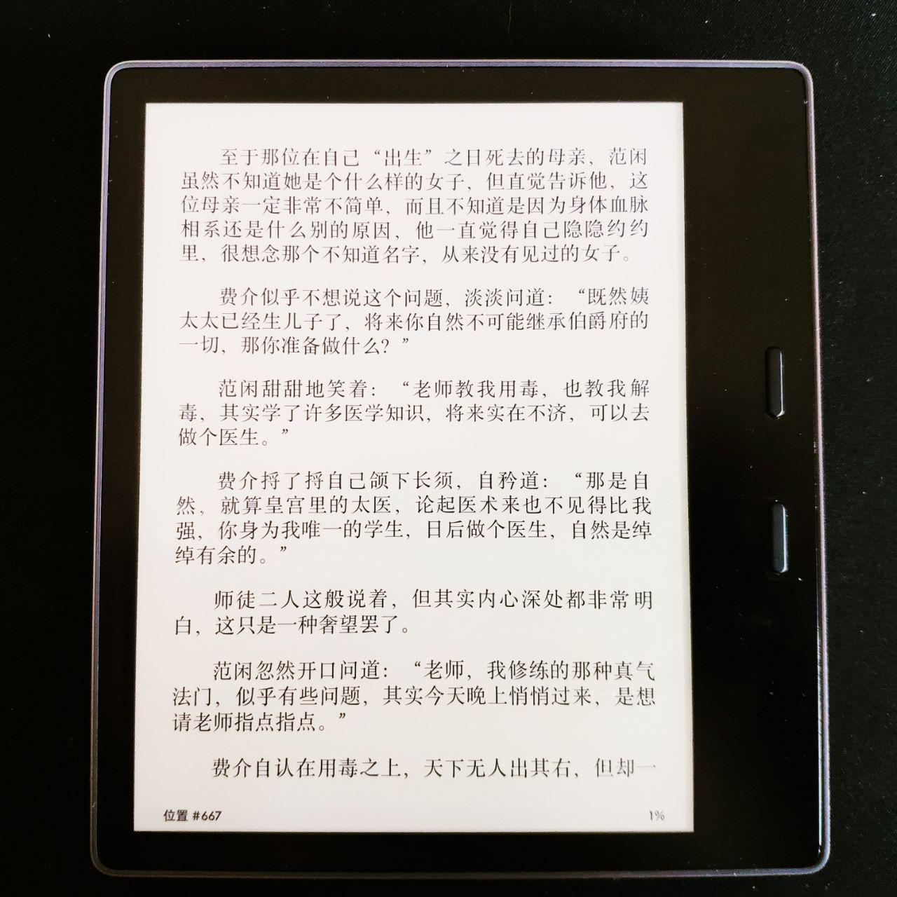
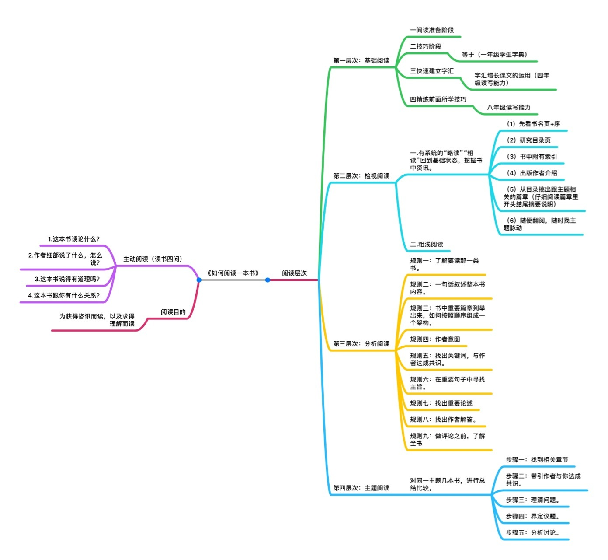
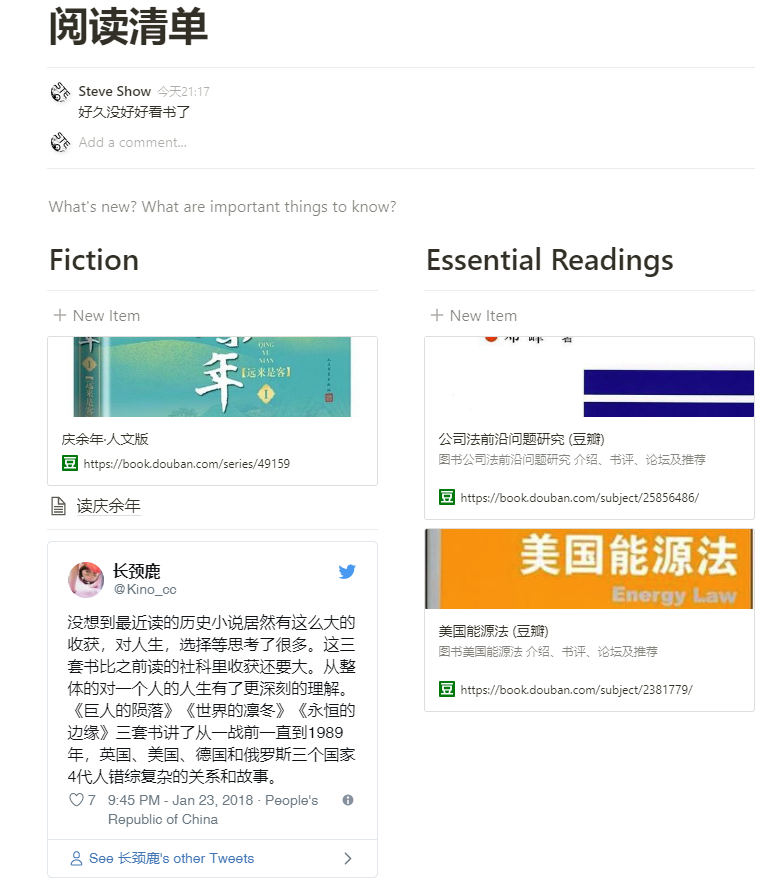

看书这个事情也要讲究科学性，这种科学性不在于设备上。我这些年确实也折腾过很多电子阅读器：Nook、Kindle以及iPad Pro，但其实都看得不多。反而是我大学时买的一台Palm TX，陪我看完很多书。所以不要追求设备，随便弄台Kindle，随身方便就好。目前用的是KO2，盖泡面挺好。

看书的科学性也不在于看得快，各种快速阅读基本都是扯淡，理解才是核心。书中内容与认知高度一致的，自然就看得快。复杂的内容就要慢慢读，细细理解。有一本《如何阅读一本书》大约就是讲这个事情的，虽然我只是看了目录部分。

我现在最大的问题是长期不看书，这是不行的。主要原因还是时间碎片化，手机刷推、聊TG的时间很多，看书根本打不起精神。我打算从小说类读物开始重新培养阅读习惯，慢慢向非小说类读物引导，这也是一种科学阅读。为此，我专门建一个Notion的页面，分左右栏来注明自己读了多少小说及非小说类读物，同时笔记也一样写在里面。

Notion同时也是非常好的笔记应用，可以添加各类Block，可以是说最为读书科学的笔记工具了。

其它不多说了，具体看Notion上的[读书笔记](https://www.notion.so/a205f411cb604146b636e800999ccc7d)吧。