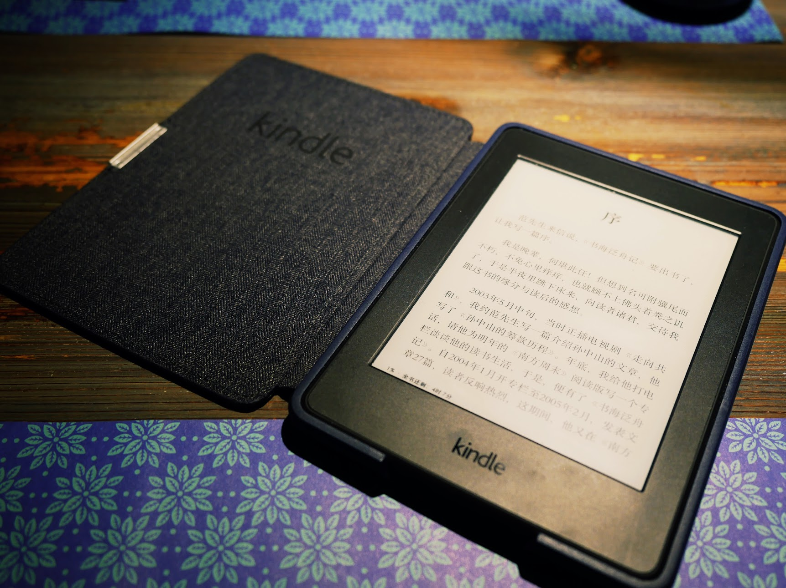
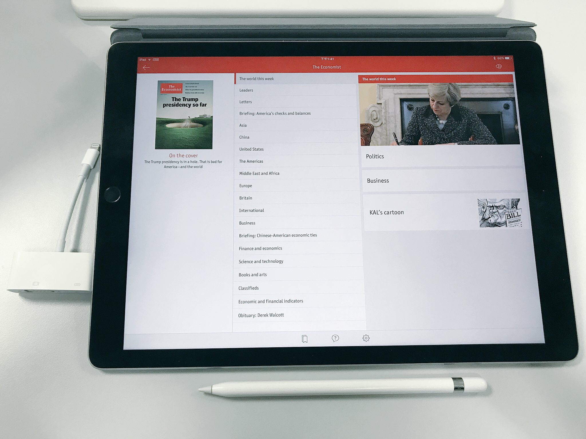
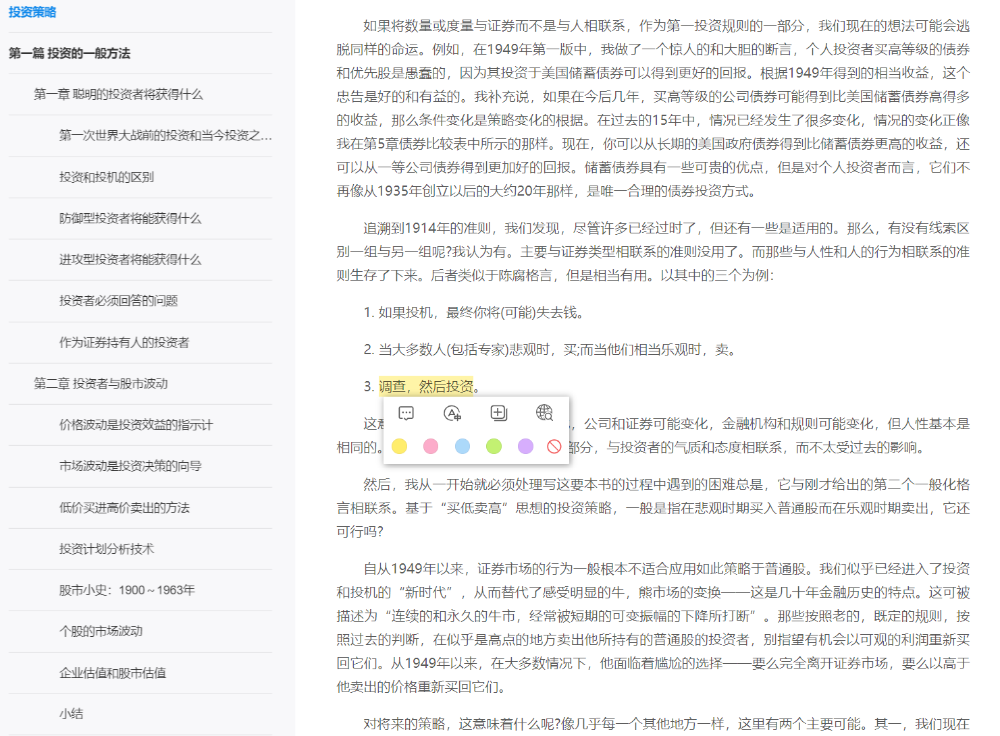
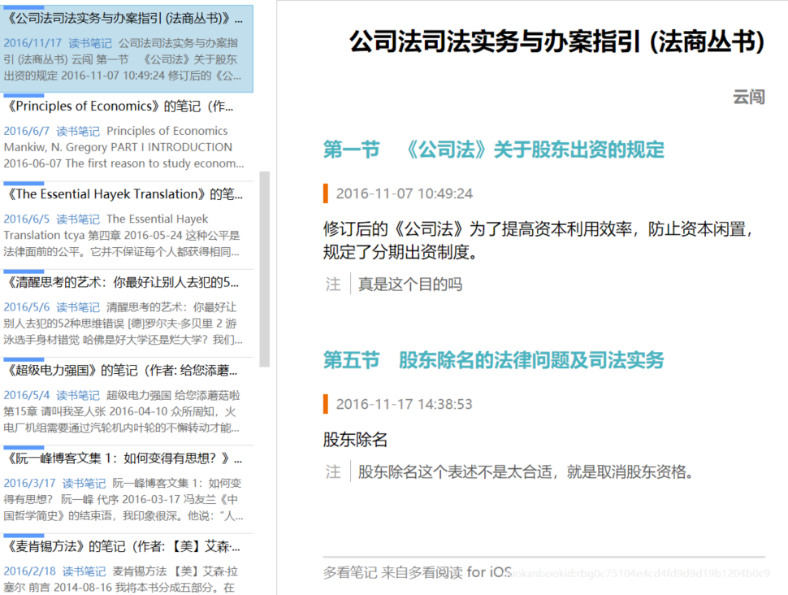
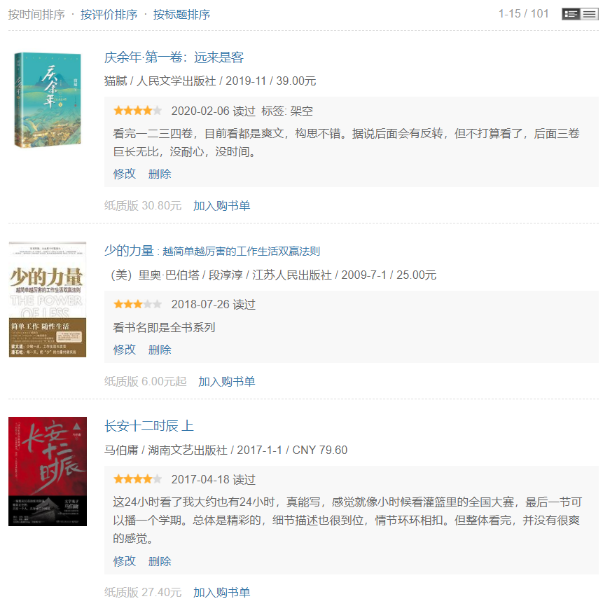
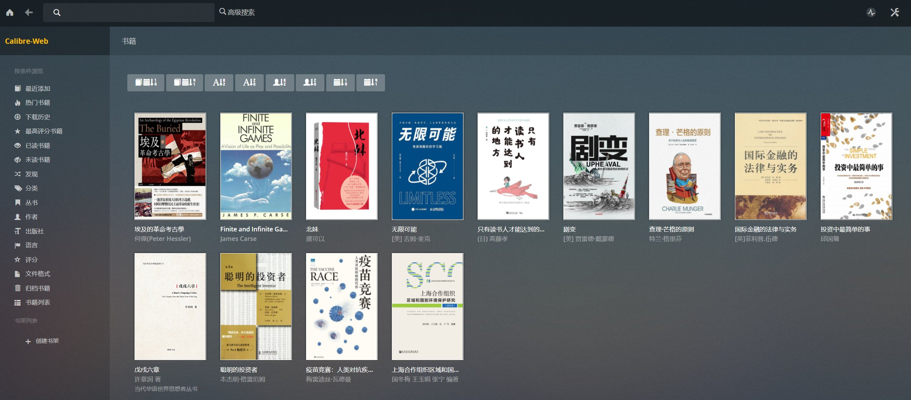
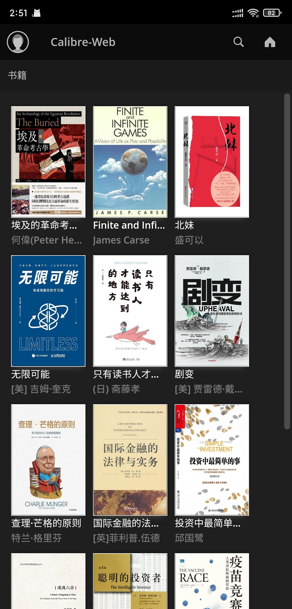

这些年读的书越来越少了，很多时候是完全依靠对于阅读设备或是相关技术的新鲜劲，才能读一点书，这也是本文的主题。

## 设备

看书这个事情也要讲究科学性，我对于科学性的追求，一开始都关注在设备上，先后买过Nook、Kindle以及iPad Pro等，但每一样其实都看得不多。

但我还是给自己找了很多买设备的理由，比如买KPW时，是因为看到各种评测、晒物的帖子里都有它的身影，自己不买个都不好意思和人打招呼。结果买来终于明白为什么它出镜率这么高，因为用来当背景真的挺好看的。

后来又买iPad Pro和Apple pencil，是因为可以全尺寸看PDF，并方便批注。不过iPad即便是Pro也还是逃不出“买前生产力，买后爱奇艺”的命运。

回想起来反而是我大学时买的一台Palm TX，陪我看完很多书，比如《近距离看美国》、《往事并不如烟》、《台北人》等。所以不要追求设备，随便弄台Kindle，随身方便就好。目前用的是KO2，盖泡面挺好。

现在用得更多的是手机，通勤时候随便看一点，坐飞机的时候看久一点，抱娃哄睡的时候会看得更多一些，但大多只能看看轻松读物，正经的在手机上看不下去。电脑上我买了个在线阅读器Neat Reader，看epub很不错。

## 笔记

看书需要做笔记，最初的时候学别人热衷于画思维导图，后来发现自己只是在抄目录。偶尔看看别人画好的导图，倒也能了解一本书的大概。

有一度很喜欢用多看，因为可以同步摘要和笔记到印象笔记里，非常方便。但也就三分钟热度，基本每本书都只有前言的笔记。

后来Notion兴起，我专门建了一个Notion的页面，分左右栏来注明自己读了多少小说及非小说类读物，同时笔记也一样写在里面。这是个很不错的笔记工具，具体可以看Notion上的[读书笔记](https://www.notion.so/a205f411cb604146b636e800999ccc7d)。

改用手机或电脑看书之后，倒不如直接发Twitter，关于某一本书的感想，写在一个thread里，要引用原文的，直接截图就好，最为简单。

## 书籍管理

长期以来，阅读都记录在豆瓣上，在年末时还能看看这一年一共看了多少书，很有成就感。慢慢地看书少了，也懒得上去记一笔到底看了什么书。大约只有在想看书评时，才会去上去看一下。

某次在尝试转换自购的Kindle电子书为epub时，接触到了calibre，觉得这工具挺不错的，管理书籍很方便。但是有些过于臃肿，用两次就不想用了。

好多年之后，知道还有个calibre-web，于是用docker跑了一个。发现这货本质就是个plex嘛，把书丢进去后，可以联网匹配书籍信息，可以转换格式，可以在线阅读。而且暗黑主题完全就是抄plex的，让人直呼牛逼。

手机端自适应也很不错，直接拿来当阅读器也不是不可以。不过我还是仅用来管理，阅读还是用多看吧。

书籍的来源，一部分是中亚自购后去DRM，然后全平台可看。图省力的话，可以在微信读书app里看，书很全。Kindle Unlimited也是差不多道理，但是书太少了，基本只有些畅销书可读。现在更多直接在网上下载盗版，愿意支持一下的，再去从正。我特别喜欢三体，除了纸质版外，几乎在所有电子平台都买了正版。

折腾了这么多，书还是没看几本，有点忧伤。
