十年前是RSS盛行的年代，十年后已变成了微信公众号的天下。微信公众号给出了一种比较简便的内容发布方案，但是不够开放，算是进步和退步吧。2019年8、9月份的时候，因为需要跟踪上海发改委网站上关于奉贤海上风电项目竞价的情况，每天打开网站看一遍，真是太蛋疼了。于是想到了自己去烧制一个RSS。

通过Google找到了Feed43，原理蛮简单，就是定时去读取网站内容，然后用类似正则的方式去匹配内容信息。试了一下就会了，制作了国家发改委、能源局等网站的RSS。
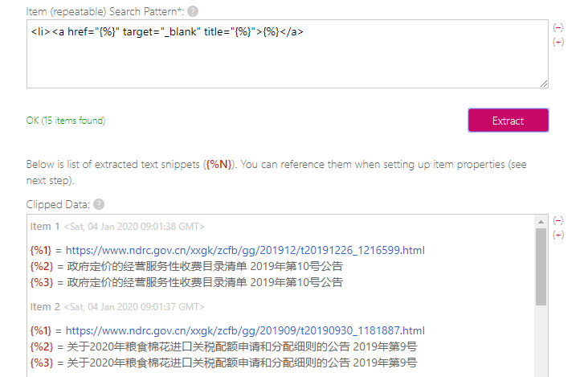

然后把这个feed丢到任何一个RSS阅读器即完成订阅。完工。

---

不过折腾总是不会这么快结束，还想要在手机上也能方便得收到实时推送。然而现在RSS式微，iOS上尚有不少优秀app，安卓上都找不到合适的。转而想到Telegram，果然有人提供rss bot可以直接用。在对话框中告诉机器人要订阅的rss链接，机器人就会在有更新时推送消息给你，轻量而且方便。不过由于是第三方的bot，用了没几天就因服务器问题下线了。所以还是得自己动手。

找到了一个go语言写的开源机器人flowerss-bot，我一看有Docker版，第一时间想到就是用群晖跑，然而由于官方镜像有点问题，没跑成功。

想起家里还有个吃灰的N1，原本刷了coreelec看片用，后来换Plex就用不上了。于是拿出来刷成armbian并写入emmc。因为有前人经验，dtb什么的都搞好了，所以这一步很顺利。
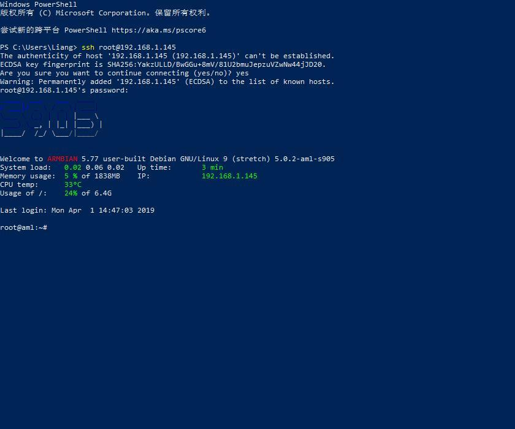

然后继续装上Docker，并弄好图形界面，这一步也挺顺利。这个可视化界面没有群晖的直观，不过多摸索一下大致也清楚了，功能上更强大。
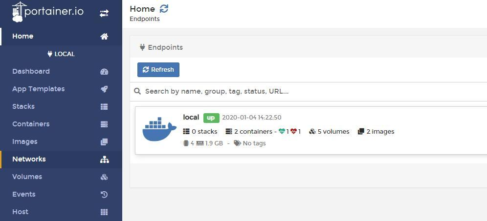

然而再进一步要运行flowerss的Docker时才发现，这个docker并不支持arm框架，等于白搞了。事实上，这些现成的docker普遍都不支持arm。于是索性直接编译，先装了go，然后go build。
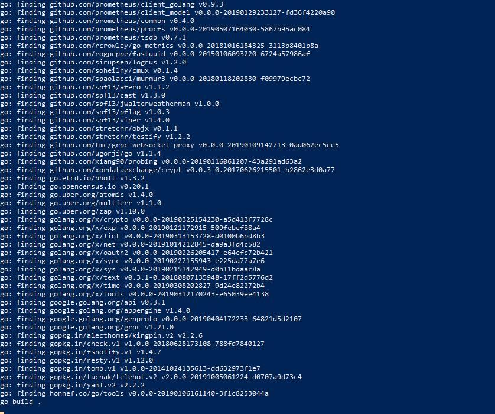

终于跑起来了，还是为了配置数据库的原因折腾了一下，最后发现不配置就可以运行。效果如下：
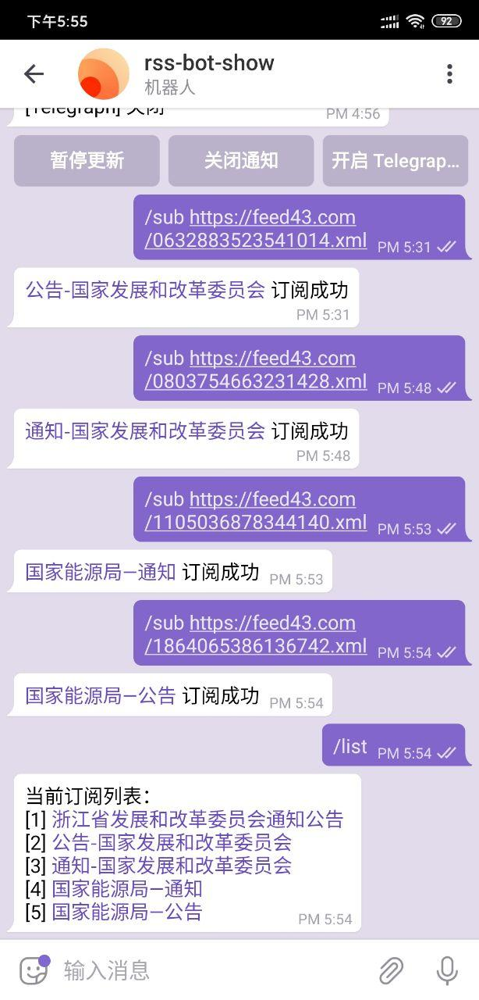

然而还是想要Docker那种可以可视化操作，于是继续打包为Docker镜像，"docker build ."，我因为少打了一个"."，折腾了很久。

这毕竟是我第一次打包Docker镜像，试了好多次，终于成功了。
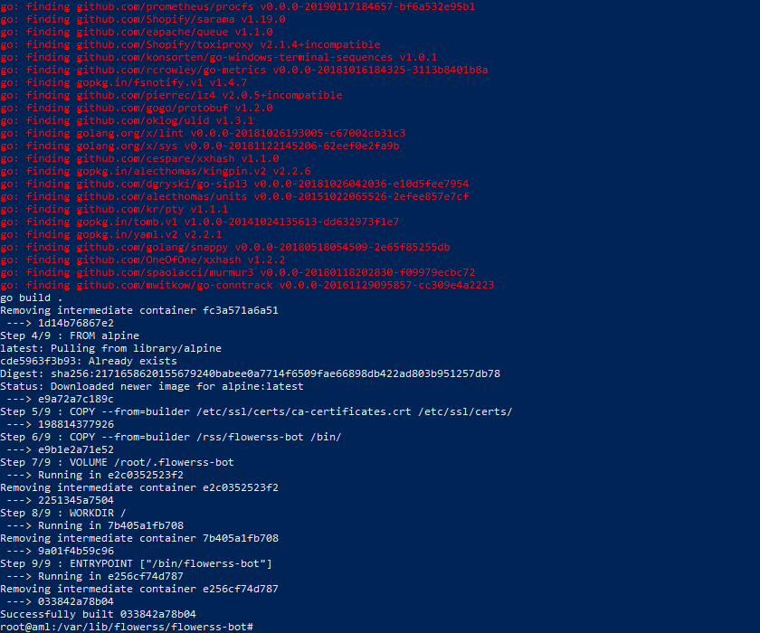

然后在Portaner里新建一个容器，成功跑起来了。这样就可以方便地查看日志以及远程访问了。
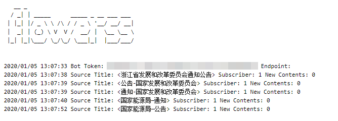

---

然而在看日志的时候发现，Feed43的源可能因为稳定性问题经常抓不到xml，而且其本身限制6小时抓一次，也不够及时。于是转而又找到一个叫RssHub的项目，也可以Docker运行，跑在自己的服务器上更放心。不过这个工具就没有那简便的可视化规则编辑界面了，需要用js语言自己写“路由”。我本想找一个路由规则抄抄，但由于完全不懂js，始终不成功。最后还是要感谢毛总帮我写了规则，我在旁边看得一脸蒙蔽。
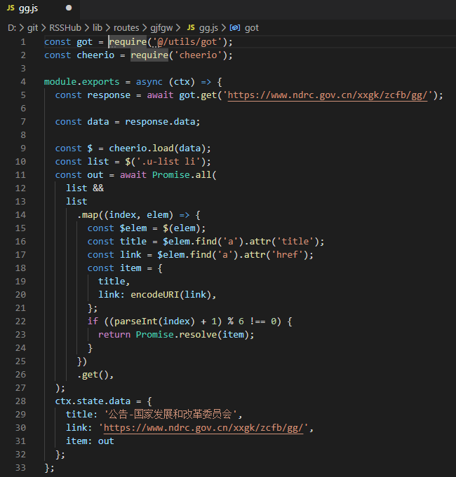

最终毛总用一个中午的时间帮我实现了国家发改委网站的抓取，并在调试后优化。抓取的内容如图：
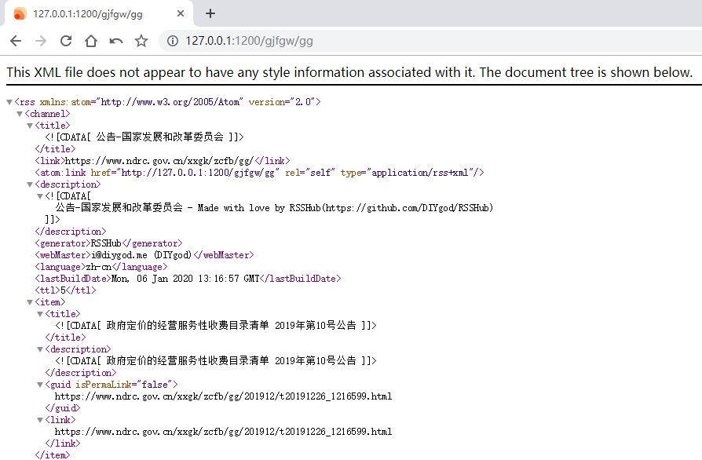

我尝试在脱离毛总支持的情况下自己写路由，一直不成功。这个工具的门槛还是偏高，我暂时驾驭不了，或许是我学习js和git的一条进路。对于已有的路由，体验还是很好的。比如这个写好全文规则的路由，配合flowerss，可以把原文转存的Telegraph，看起来很方便。
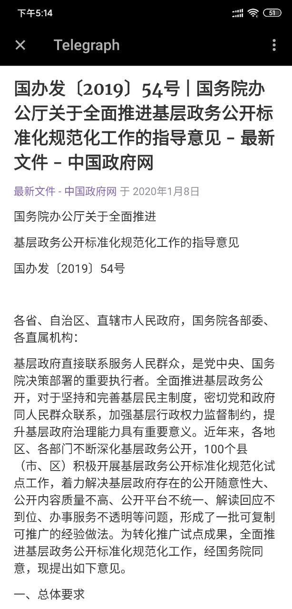

---

转而找到另一个工具huginn，直接跑Docker，有可视化界面，通过指定xpath路径实现内容抓取，编写规则和测试都简单很多。我试着写了规则，很快就抓到内容了。
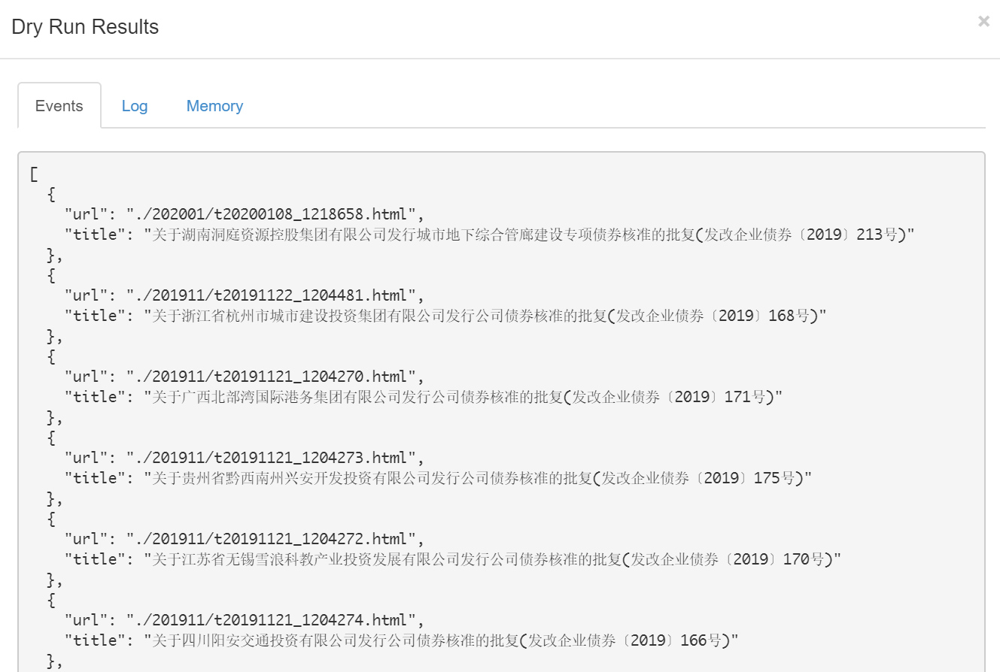

然而，这里抓取的链接并不完整，还需要拼接上网址前缀；但又偏偏多了一个点，很难处理。于是还是得靠毛总帮忙，终于把那个点去掉了。
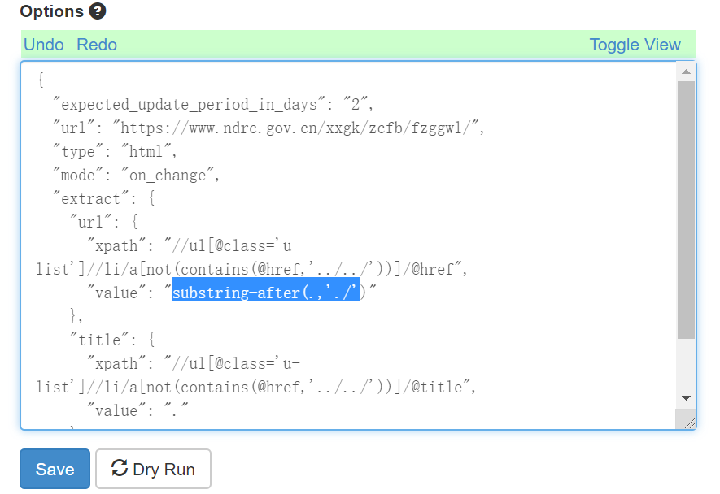

这还只是抓取的agent，还需要再另建一个生成rss的agent，把抓到的数据进行输出，有点麻烦。这东西看起来简单，但实际实现起来还是不易，可能还不如RssHub。折腾了半天可能还是Feed43最适合我，时效性和稳定性上虽然会略差一点，但是影响不大（又不是不能用）。

---

为了能让别人也能看到这些订阅结果，又另新建一个频道，并把bot加进去，由bot来推送信息。
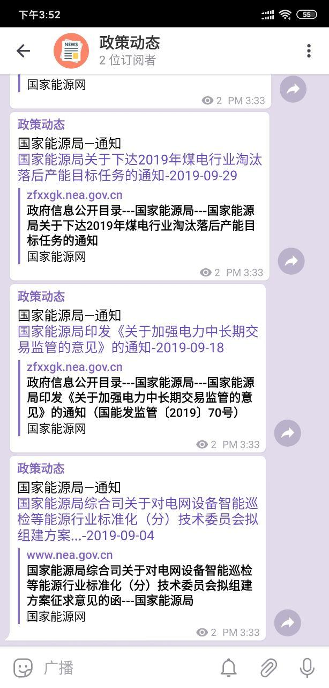

---

搞了这么多东西，只是为了在第一时间可以了解到这些网站的最新政策动向，希望对工作会有帮助。这次折腾的附带体会是，Docker真好用，很多原本商业化的服务，现在也可以很简单地在自己的服务器上跑了；服务器也未必一定是个大家伙，像N1这样的小盒子，甚至是更小的pi，都是很不错的轻量服务器；portainer这个容器管理界面我也很喜欢，比群晖那个更灵活，配置更丰富，远程访问也更为方便。
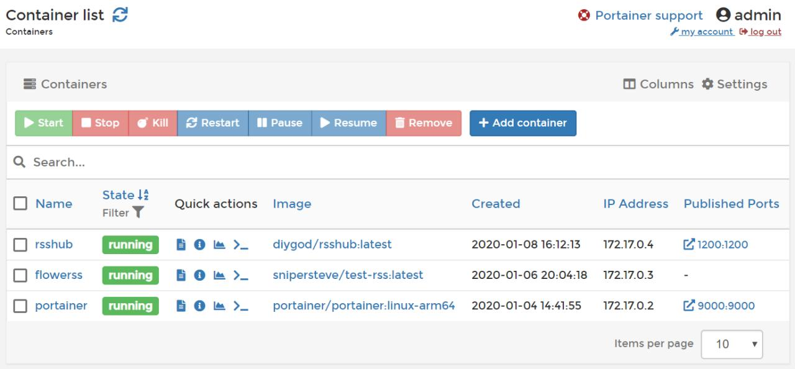

完结撒花。