十年前是RSS盛行的年代，十年后已变成了微信公众号的天下。微信公众号给出了一种比较简便的内容发布方案，但是不够开放，算是进步和退步吧。2019年8、9月份的时候，因为需要跟踪上海发改委网站上关于奉贤海上风电项目竞价的情况，每天打开网站看一遍，真是太蛋疼了。于是想到了自己去烧制一个RSS。

通过Google找到了Feed43，原理蛮简单，就是定时去读取网站内容，然后用类似正则的方式去匹配内容信息。试了一下就会了，制作了国家发改委、能源局等网站的RSS。

然后把这个feed丢到任何一个RSS阅读器即完成订阅。

完结撒花。

---

不过折腾总是不会这么快结束，弄完又想着在手机上也能方便得收到实时推送。记得在Telegram上有现成的bot可以用，找了一下果然发现有人提供了Rss bot。在对话框中告诉机器人要订阅的rss链接，机器人就会在有更新时推送消息给你，轻量而且方便。不过由于是第三方的bot，用了没几天就因服务器问题下线了，所以还是得自己动手。顺着这个bot找到了源码，是一个go语言写的开源机器人：[flowerss-bot](https://github.com/indes/flowerss-bot)。

为了跑这个服务，把家里吃灰的N1拿出来刷成了armbian。这台N1原本是刷了coreelec看片用，后来换Plex就用不上了。U盘刷完armbian后引导启动成功，再写入emmc。因为有[前人经验](https://yuerblog.cc/2019/10/23/%E6%96%90%E8%AE%AFn1-%E5%AE%8C%E7%BE%8E%E5%88%B7%E6%9C%BAarmbian%E6%95%99%E7%A8%8B/)，dtb什么的都搞好了，所以这一步很顺利。

然后打算跑这个服务，但作者并没有提供arm版的程序，只能自己编译。先装了go，然后go build。

终于跑起来了，然后为了配置数据库的原因折腾了一下，最后发现不配置就可以运行。成功运行后，在Telegram上用/sub命令就可以订阅，效果如下：

订阅的源有新文章后会自动转存到Telegraph，如果源本身有原文的话看起来很方便。

---

不过，还是想要群晖Docker那种可视化操作界面，于是继续装上Docker，并弄好图形界面。

把flowerss的官方docker镜像拉下来发现，这个docker也不支持arm框架。于是继续在arm环境下运行dockerfile打包为docker镜像。这个命令是"docker build ."，我因为少打了一个"."，折腾了很久。

这毕竟是我第一次打包docker镜像，也没有换源啥的，试了好多次，终于成功了。

然后在Portaner里新建一个容器，成功跑起来了。这样就可以方便地查看日志以及远程访问了。

---

然而在看日志的时候发现，Feed43的源因为稳定性问题经常抓不到xml，而且其本身限制6小时抓一次，也不够及时，想着如果能自己部署一个Feed43服务就好了。在Github上搜索，还真的找到有人写了一个仿Feed43的[程序](https://github.com/t812206236/rss_push2)，从其示例来看，基本和Feed43一致。但为了部署这个程序，我还得先学学java，再说吧。

转而又找到一个叫RssHub的项目，可以在Docker里运行，跑在自己的服务器上更放心。
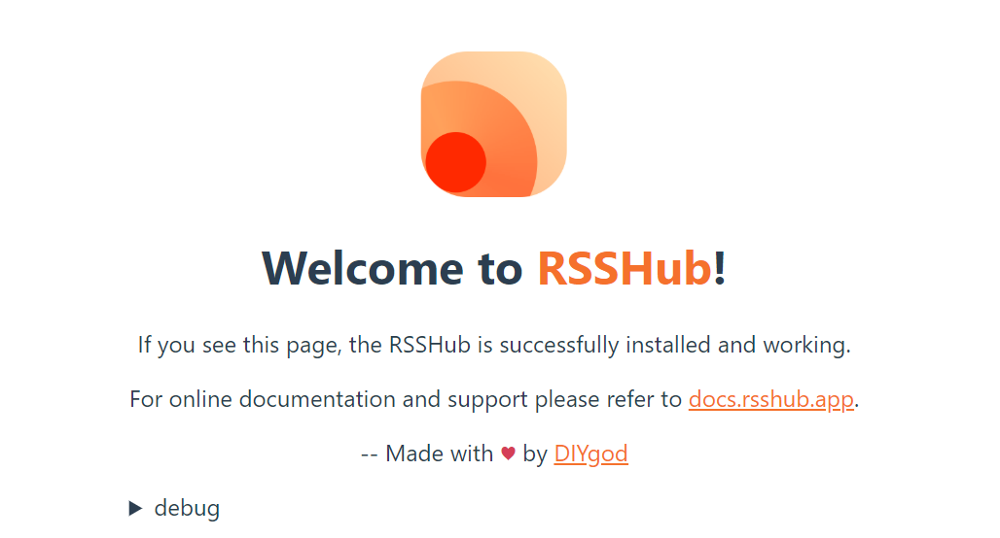

不过这个工具就没有那么简便的可视化规则编辑界面了，需要用js语言自己写“路由”。我本想找一个路由规则模仿着写一个，但由于完全不懂js，始终不成功。最后还是要感谢毛总帮我写了规则，我在旁边看得一脸蒙蔽。

毛总用一个中午的时间帮我实现了国家发改委网站的抓取，并在调试后优化。抓取的内容如图：

后来索性向毛总请教如何写路由，在漫长的试错之后，终于学会抓一些简单的博客类网站，比如律所官网，学会之后还是很有成就感的，以后可以出去自称精通node.js了。
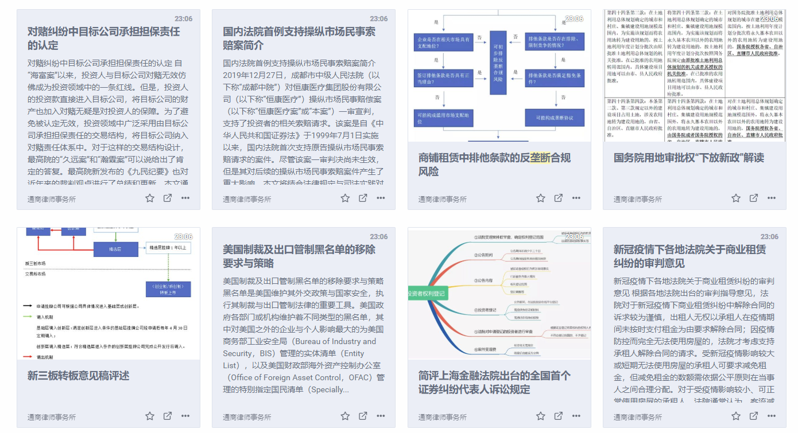

RssHub还有一个很不错的路由是邮件收取，即通过imap协议收取邮箱中的邮件为RSS。我为此注册了一个Gmail邮箱专门订阅一些Newsletter，然后配置账号信息到RssHub的环境变量中。老牌RSS服务Inoreader在最近一次[更新](https://sspai.com/post/58690)后，也支持了这个功能（收费功能）。
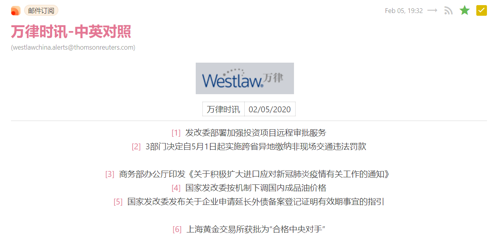

---

转而又找到另一个工具huginn，同样可以直接在Docker里跑。这个工具有可视化界面，通过指定xpath路径实现内容抓取，编写规则和调试都简单很多。我试着写了规则，很快就抓到内容了。

然而，这里抓取的链接并不完整，还需要拼接上网址前缀；但又偏偏多了一个点，很难处理。于是还是得靠毛总帮忙，终于把那个点去掉了。

这只是抓取文章列表的agent，还需要再另建一个抓取全文的agent和生成rss的agent，有点麻烦。暂先不管全文，单单只抓文章标题和链接还是比较简单的，套路差不多，很快我就把我常看的几个网站都搞定了。
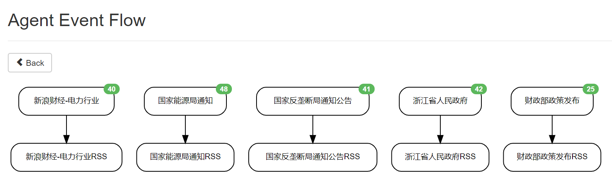

---

用了一段时间发现，现在很多机构写的干货内容都不放网站而放在微信公众号里，而微信公众号的反爬策略非常严格，尝试用Rsshub里的几个路由抓取都不成功。放狗搜了一下了解到WeRSS这个付费服务，基本上公众号都有收录，界面也不错，35一年价格（8个公众号）也还可以，于是就买了。
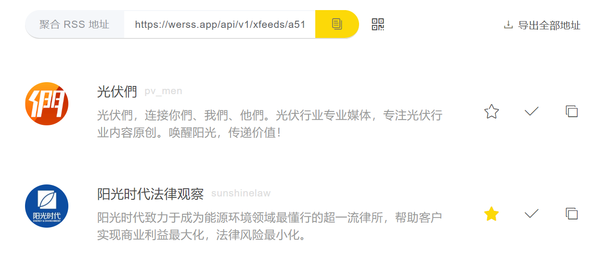

订阅之后发现公众号的通病是无关内容太多了，往往是一篇干货、一篇广告混在一起发，看起来很难受，必须得有过滤功能。于是又找到了一个自建RSS服务Tiny Tiny RSS，带有内容过滤功能。这个服务比较复杂，需要装好几个容器，不过很妙的是，有人提供了[docker compose](https://github.com/HenryQW/Awesome-TTRSS/blob/master/docker-compose.yml)方案，一条命令就把这些全装好了。
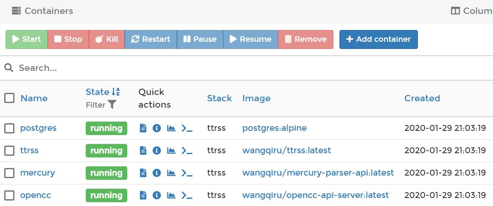

服务端装好后，网页端打开网址就能用，体验几乎和Google Reader一致，甚至有个插件可以模拟GR的快捷键；只不过这个是完全跑在自己服务器上的服务，不必担心Google大刀砍产品。
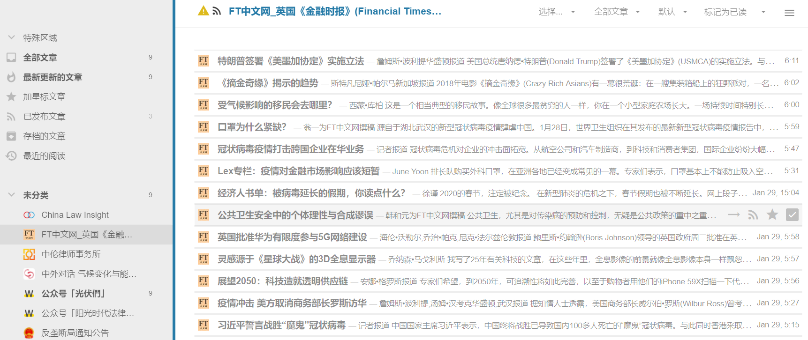

导入OMPL订阅后进设置里添加过滤规则，通过正则表达把一些不需要内容过滤掉。
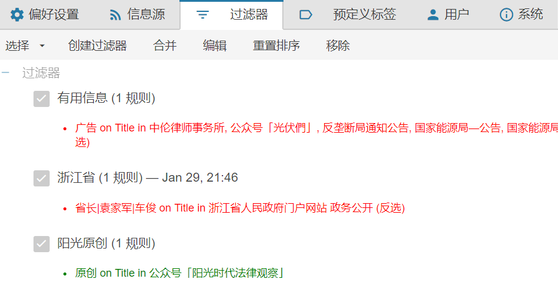

而且更妙的是，过滤之后的动作里，有一项功能是公开发布，即把筛选出的内容重新发布到一个整合的rss源里，把这个源共享出来就可以让别人也看到这些资讯了。
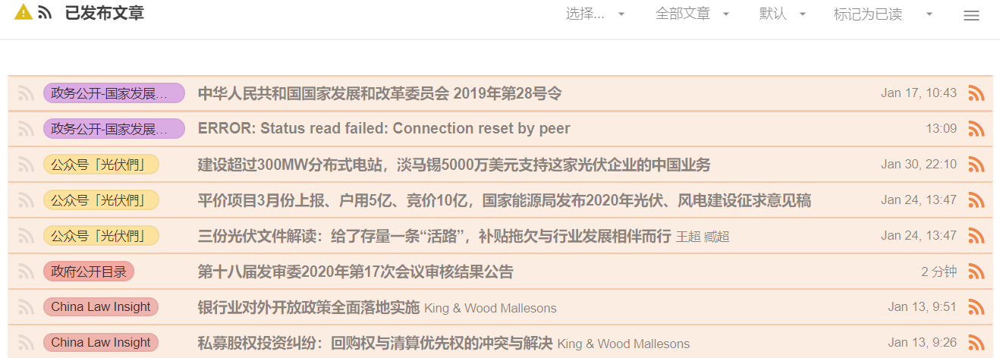

另一个意外之喜是里面集成了全文抓取的api，而且这个api也是开源的，跑在自己的服务器上，并在TTRSS里作为一个插件，针对不同的feed可以单独设置。
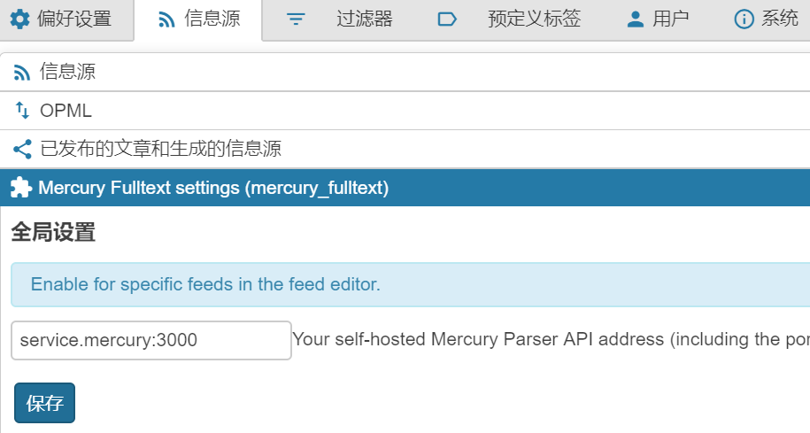

设置好全文抓取，对于没有提供全文的RSS也可以在阅读器里看到原文了，非常方便。这一功能与huginn或是Feed43是绝配，只要能抓到标题和原文链接丢给TTRSS就能生成原文，不能更好。效果如图：
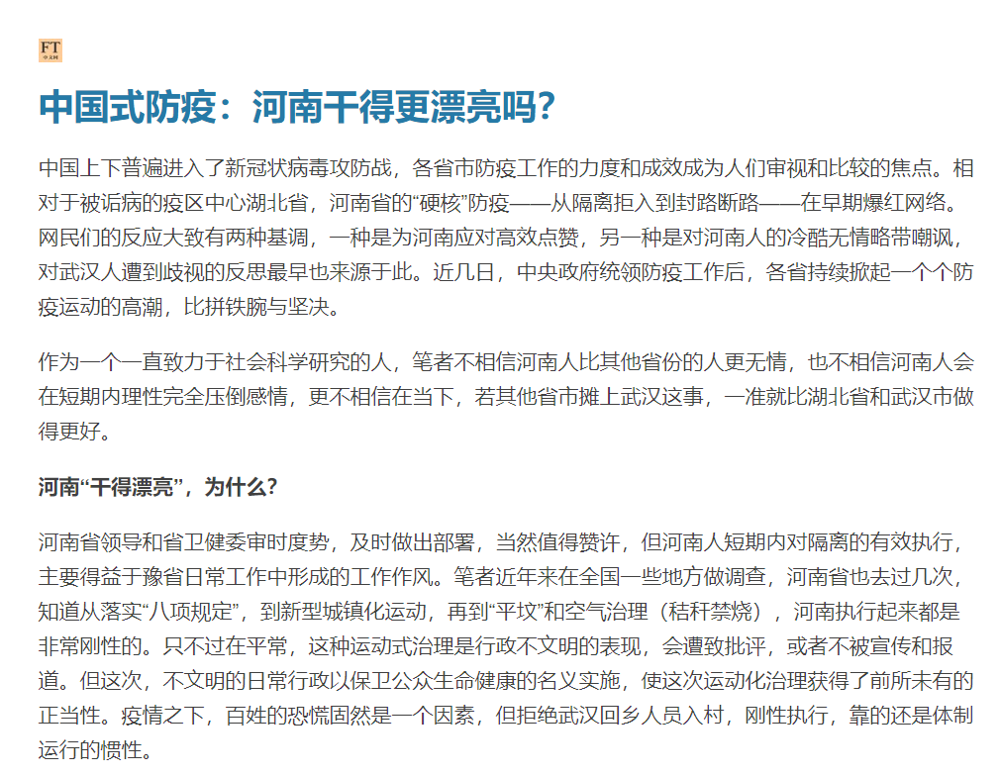

TTRSS另提供了一个模仿Fever服务的插件，可以让一些支持Fever的第三方RSS阅读器变相支持TTRSS，思路很奇特。不过我选了一个原生支持TTRSS的客户端FeedMe，效果挺不错，这样就可以在手机上刷刷刷了。
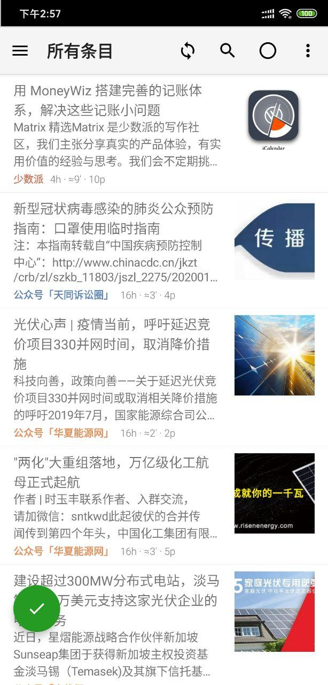

---

作为副产品，在Telegram上新建一个频道，并由flowerss bot来自动推送信息。有兴趣的朋友可以[关注](https://t.me/china_policy)。
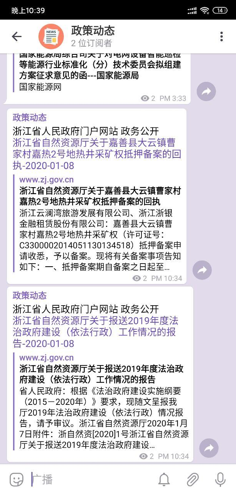

这个rssbot实在是太好用，非常喜欢，出于稳定性考虑决定转移到群晖跑。然而由于官方镜像有点问题，没跑成功，于是用dockerhub在线编译了一个，然后在群晖里跑就没问题了。
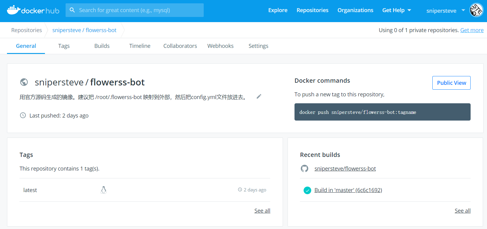

---

目前这套方案总结一下：源的抓取根据不同情形用到了huginn/Rsshub/WeRss/Feed43，然后经TTRSS筛选整合后发布出来，并通过flowerss订阅并推送到Telegram频道里。搞了这么多东西，只是为了在第一时间可以了解到能源行业最新政策动向，希望对工作会有帮助。现在每天一早打开TTRSS，就有信息扑面而来，这种感觉很好。
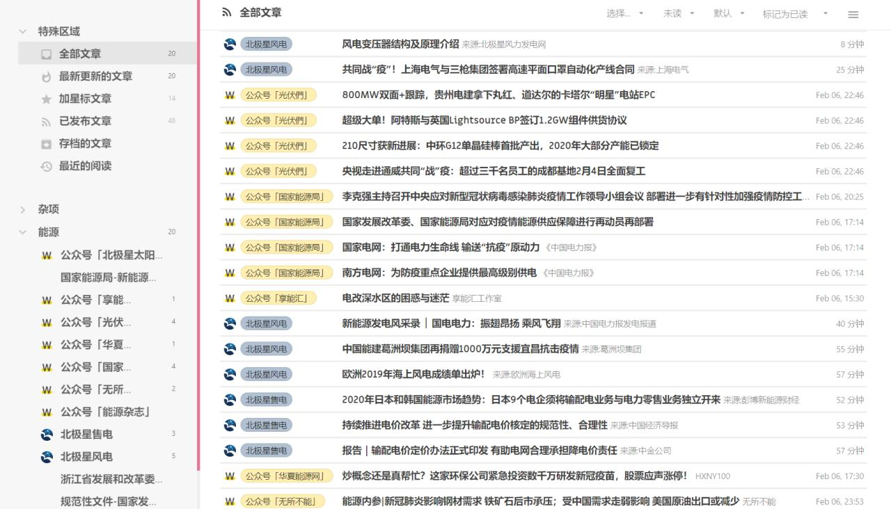

这次折腾的附带体会是，Docker真是便利，部署服务和手机上装APP似的；开源社区真是牛逼，很多原本商业化的服务，现在也可以很简单地在自己的服务器上跑了；服务器也未必一定是个大家伙，像N1这样的小盒子，甚至是更小的pi，都可以当很不错的轻量服务器；未来的趋势是服务端私人化，自己搞定大部分服务的部署；即便不学编程，也要懂得如何部署、调试，一点点自学吧。

---

update after 2 months：换成了付费方案inoreader，50刀一年，带生成feed、过滤、邮件摘要、关键词高亮、动态搜索等功能，真香。
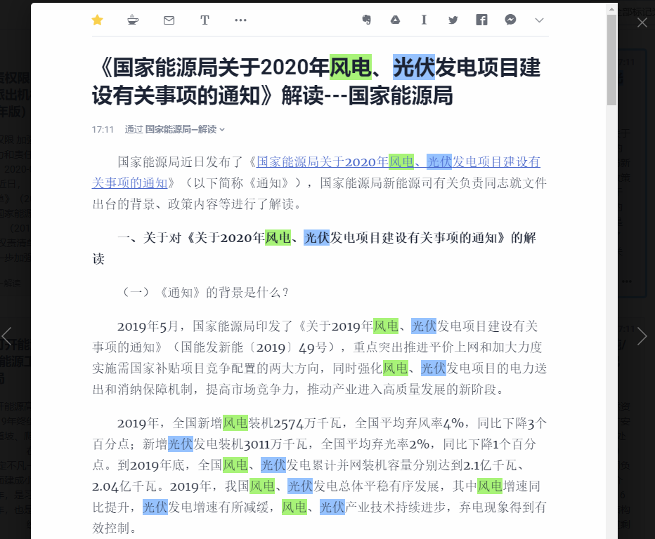