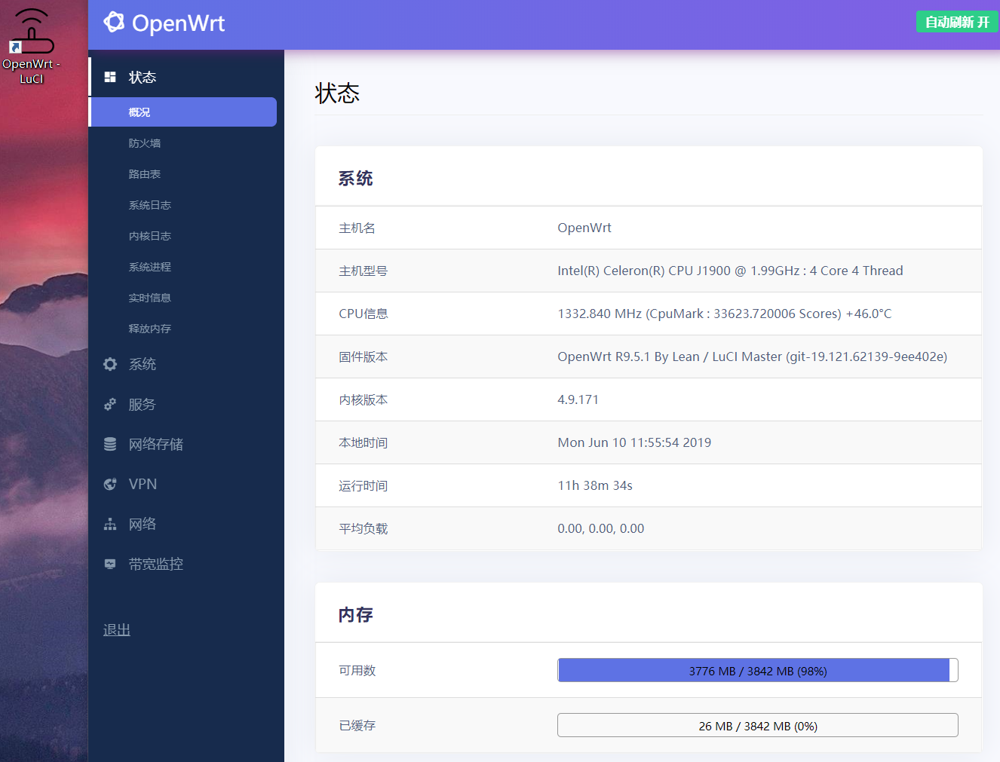

我的智商极限大约就是折腾路由器了。

小时候家里没有电脑，跑去表哥家里玩游戏，那时候是拨号上网，联网之后电话就打不进来了，所以妈妈叫我回家吃饭却打不通电话，只能干着急。

后来自己家里也买了电脑，每次开机都要先拨号，总要等好一会儿才行，经朋友指点装了一个路由器，记得是水星的。在路由上完成拨号，比电脑上来得更快。虽然只是填个宽带账号的事情，还是研究了半天。搞明白之后，还跑去小姑娘家里给人家设置，弄好之后我就很老实地回家了。

读研究生期间上网需要锐捷认证，很蛋疼。想学人家把路由刷openwrt并跑锐捷，但是搞不懂，最后只能在电脑上插个360wifi来解决，给iPad之类的设备提供无线。后来学校把这类wifi硬件都封了，必须用修改版的锐捷才能正常运行，很难受。最后找导师要了他的Teacher帐号，WIFI直连外网，放弃锐捷。

工作后自己租房子住，在淘宝上买刷好PandoraBox的小米路由mini，为的是在路由上实现透明代理。买了之后发现这货操作反人类，费了很大劲才设置好拨号，而且不怎稳定，用了一段时间就闲置了。作为米粉的我又买了小米路由硬盘版，上网性能一般，但好处是能远程下载电影以及自动追美剧，同时学会用samba实现在电视上看路由器里电影，速度也很快。同时顺带了解了NAS这种东西，研究了一下群晖、Gen8之类的产品，以及HyperV、ESXi之类虚拟技术。

然后就忽悠单位买了群晖，主要用于企业数据备份和共享，8盘位，raid 5。一开始用QuickConnect来远程访问，很方便但速度不理想。为了能够相对快速地实现远程访问，专门研究了一下ddns，搞了个花生壳的动态域名。这其实挺傻的，因为单位的专线其实是有公网固定IP的，这是后话，不表。

自己又跟风买了Newifi mini，刷各种固件极为方便，发现老毛子固件真好用，相较openwrt直观太多。在路由上设置好ss后，所有终端免翻，真是居家越货必备良品。同时可以设置adbyby、KMS等功能，十分强大。顺便在阿里买了个域名，用aliddns可以实现远程访问。但因为家里有两台路由，为了用aria功能，又研究了半天端口转发的问题，挺头疼。

Newifi用起来各种好，然后开始到处安利，并囤积居奇，买了一打放在家里，送给有需要的朋友。期间上门给导师装了一台，设置好翻墙和去广告，导师表示对其科研有很大帮助，并表示要给我介绍女朋友。我后来又开始买已经下车了的K2/K2P，刷好荒野无灯的固件并配置好搬瓦工的ss线路送朋友，到手插网线就能用。但因为不可描述的原因，不久之后就不能用了，我也不可能上门去维护，后来便放弃了。

我自己则把原先用的Newifi淘汰下来，换成Asus ac66u b1，刷梅林。梅林固件有个插件中心，按需要安装，独立更新，用起来更方便。这货的最大问题是温度常年70度往上，我经常用它来温一下过于冰的可乐。后来专门给它配了个USB风扇，温度降到50度左右。

顺手把单位里的R8000也刷了梅林，在全所范围内实现ss、kms和去广告，自己方便，别人也方便。配合AP，全面覆盖，无缝漫游。有一次内部开会，有个同事说因为在单位可以上Google，查资料方便，所以很愿意加班。老板听了很满意，频频冲我点头，但并没有给我加工资。

最新的梅林固件开始支持AiMesh，于是我又买了一台66u b1，两台共同组AiMesh，有线回程。然而某天我突然发现自己其实根本不需要无缝漫游，因为家里实在小，一台K2P完全可以覆盖了，而且发热量还小。撤掉两台66u，收进车库里吃灰。

另一方面，科学上网的变化日新月异，转眼间我已数次换了机场，换了跨栏方案，路由器上的ss不带混淆，已无法用了。于是改为在终端翻，策略组分流，ios用quantumalt，android用surfboard，win用clash。其中clash是我最喜欢的，开源稳定，在PC上用clash之后几乎再没出过不能上网的情况。

偶然了解到旁路方案，本想把一台闲置的MacBook装上surge当网关用，无奈surge太贵买不起。后来经安利买了一个orange pi zero plus，和我早年买的树莓派是一个道理，不过这个更小，而且是千兆口，CPU也更强。刷了群里老竭力改过的PandoraBox固件，已内置了ssr plus，支持订阅和故障转移，非常好用。把xbox网关指向Pi就可以实现翻墙，看Netflix速度很棒，和老婆晚上在家看4K的纸牌屋，很开心。

正好电信有免费提速到200M的优惠，就办理了，结果提速后家里测速还是只有100M，问了才知道精装修装的交换机是百兆的，真的垃圾。本想买个千兆交换机放弱电箱，后来转念买了台Newifi3，刷lean固件，拆了外壳后勉强可塞进弱电箱，发热量也还好。将Newifi作为主路由，关无线，挂ssr；K2P使用AP模式，连WIFI；Pi专供Xbox，保证视频速度流畅。

这套方案本身挺合理的，只是裸板放弱电箱还是不放心。某天出差，临时起意买了个四口的J1900。到手后发现做工真好，被动散热效果就很不错，夏天也仅40多度。而且大小适中，正好可以放进弱电箱，把新三给换下来。性能上，跑分可以跑三万多，但是看Netflix的速度基本还是一样，估计瓶颈在线路本身的速度。软路由配合K2P的AP，硬件上暂不需要折腾了。

J1900买来就是刷好了lean openwrt的成品软路由，用了一段时间下来十分稳定。原本还想折腾一下PVE虚拟化，然后再跑路由系统，但查了发现J1900不支持网卡直通，作罢，也省去了折腾的心思。网上看到有一种思路是先PVE虚拟化后，跑一个Openwrt，再跑一个Linux定期pull最新源码并编译后自动更新Openwrt，这个操作太骚，学不来。

Pi暂时闲置了，作为测试clash的专用机器。clash及luci clash尚处于测试阶段，有一些小毛病，不如终端上的版本稳定。最新版本clash上开始引入fake-ip模式，但我并没有搞懂，大约就是防DNS污染的一种方法。总体能用，成熟后可以部署到主路由上。

535期间没事干，翻出早年买的一个小黄路由——GL MT300N V2，在吃灰多年后，经更新固件终于可以支持华为4G网卡，插上即可上网。其固件本质为openwrt，套了个一定制的界面。进ssh刷上ssr plus，可用，但性能较弱。并没有想到可用场景，就当玩玩吧。

为了能远程看到家里的网络情况，打电话给电信改了桥接，然后用主路由PPPOE拨号，并在阿里云买了一个域名，用于ddns；搞了证书，可以远程https访问到路由器管理页面。这个操作看起来并没有什么卵用，但实际上打开了一扇大门。

实现远程访问后，在家里搞了一台群晖415+，4盘4T跑raid5，约10T的可用容量。装了cloudsync来下载百度盘和Google Drive上的资源。装了docker跑一个同步到Google photos的容器。其它似乎也没啥好玩的，有点过于简单，没得折腾。

所里的群晖，一度没有好好利用起来，速度不理想。直到所里请了一位高手，优化了所里的网络架构，内外网访问都不成问题。速度上来后，Drive、Webdav等功能终于可以利用起来，有望成为提升工作效率的强力工具。另，利用docker也跑了个clash在上面，可以作为旁路用。

在2019年这一年里，眼看着Clash这个开源软件一步步走向全平台（iOS除外），感叹开源社区的强大。我现在电脑、手机、路由器都是用Clash了。Clash配置文件基本是全平台共用的，我一开始写好配置后放在群晖里托管，后来发现放gist管理更方便；最后索性跑了一个转换服务，可以把服务商的订阅转换成自己喜欢的配置并可以自动更新。

---

我感叹网络技术真是深不见底，越到底层我越搞不懂，这大约是我智商的极限了，如果有空我得去读一读TCP/IP，了解一下底层原理。不过这种软硬结合的玩法真的有趣，学习效果也很好，我已然将其视为一种乐趣，而超过实现科学上网功能这一初衷。

这一感觉和网友[@cxiaoji](https://twitter.com/i/web/status/1126165698978271232)说的很像：
>我对数据结构有非常美好的回忆。我真正开始理解编程就是在贵系蹭的数据结构课。老师没打开过教材，上课就一个编辑器，从头写一个类，一边讲一边往里面添方法。讲完编译，测试，通过，正好下课。我期末要熬图根本没工夫复习的，但是这门课学的东西一点都没忘。

今天碰巧看到关于shadowsocks发展史的一篇[文章](https://github.com/JadaGates/ShadowsocksBio)，让人唏嘘不已。其中ss和ssr的故事再一次重演，发生在clash和clashr上。Dreamacro写的clash为开源项目，但不支持ssr协议；因很多机场只提供ssr节点，广大小白用户希望支持ssr协议的呼声很高；lvguangfa在clash核心上加了ssr支持，闭源，向机场主收费，被人肉，被迫开源。历史总是惊人的相似。