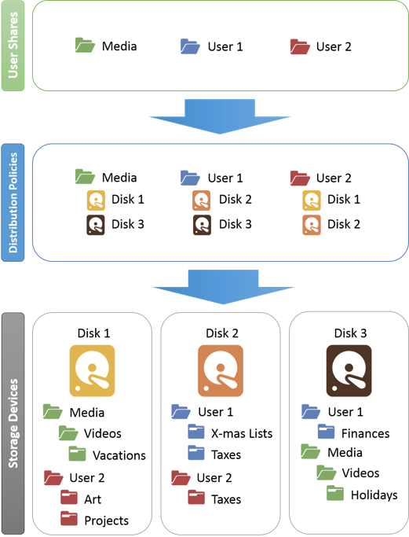
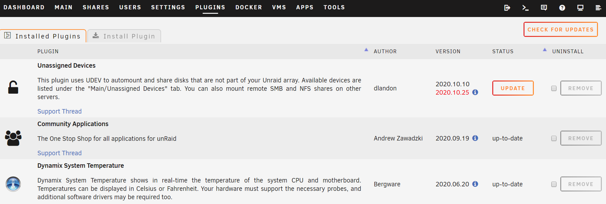
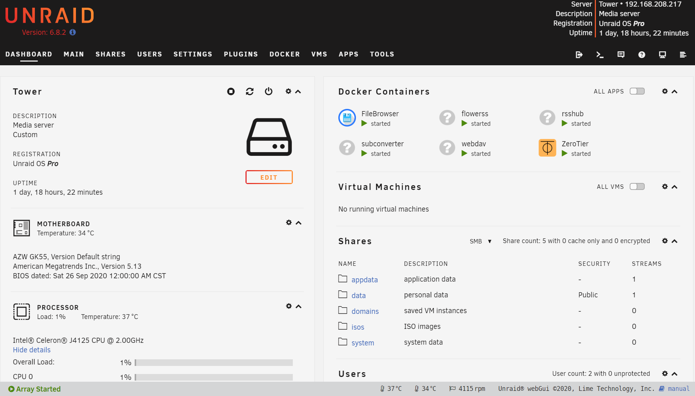

家里一直是一台群晖+一台N1的组合，前者负责存储并跑一些服务，后者跑PT并跑了一个OP旁路，挺科学，也很稳定。然而不知从什么时候起，反复听到Unraid这个系统，心里开始痒痒。

关于unraid听的最多的就是All in one，但其实把所有东西都整合到一起并是个很好的主意。比如路由的部分，我更倾向于独立出来，用一个ubnt er-x当主路由，安安稳稳，没掉过链子。但我还是想着要体验一下unraid，于是买了一台J4125的小主机，8+256的配置，计划就是当个小服务器跑跑；最不济，刷成软路由也行。

很小巧的机子，unraid安装也非常简单，单纯把文件拷进U盘即可。上手后发现硬盘组阵列也很简单，而且很自由，设置也很丰富，比如服务类的存储都限定在固态上，而把媒体类限定在机械上，无访问的情况下硬盘自动休眠，最大程度上保护硬盘及省电。如果硬盘损坏，即使没有校验盘，也只是损失这块硬盘上的内容，于其它资料没关系。这大约是Unraid相较于群晖类跑raid模式的最大优势吧，也是其名字的由来。

阵列组好后，开始玩docker，有个app市场，本质上是docker模板以及一些plugins的合集，用起来很方便。市场上没有的，就按传统方法装docker。docker装好后管理起来非常方便，随意编辑修改，一键更新，操作更人性化。插件的更新也是一样，这个要打满分。

然后玩虚拟机，装了一个黑群试试，也非常简单。不过群晖里比较出彩的几个套件大概也就Drive、Moments、Cloudsync等，其它都不如直接跑docker。由于家里那台群晖还在正常跑着，于是转手又删了。以后可以考虑把家庭照片、个人资料等重要文件存到这台机器的固态上来，更安全。同时跑onedrive云备份，确保万无一失。

本还想再装个centos虚拟机，远程调试rsshub用。后来一想unraid本身就是linux，不如直接在底层跑。于是在Nerd Tools里一键安装了git，并把自己的仓库拉下来。然后跑了一个rsshub的docker，并把路径指好，就算是部署好了调试环境：vscode远程连过去编写路由，然后通过重启docker并看log的方式来调试，一种偷懒的办法。

如果只是跑这些docker未免有些性能浪费，于是又想起Plex来。同样用docker安装了一个，并挂载了群晖的一个媒体盘作为其媒体库。由于themoviedb等数据库都被墙了，所以必须有前置的科学上网。事实上，unraid使用最好有前置代理，否则app市场都打不开，docker部署也麻烦。不过实测走代理后，本地plex与plex服务器连接存在问题，我在openclash上设置了DOMAIN-KEYWORD,plex,DIRECT，避免向plex服务器错误汇报代理的IP。设置好后连接正常，影片及剧的信息都识别很准，即便不观影，光看看海报墙也是舒服的。

然而J4125的硬解我一直没搞定，据称是Intel的BUG还没修，只能等等。实测CPU软解的话，卡成PPT。为避免转码，可以把烧录字幕的选项设置为仅图像，这样可以避免对ASS字幕转码，降低CPU负担，但ASS的特效也就没了，成为普普通通的字幕。在直接串流播放的情况下，效果完美，其APP胜Jellyfin等十余条街，比Kodi的体验也好很多。

所以这大致就是unraid的用法，理论上可以把实体群晖淘汰掉，把影片服务、文档备份、照片共享及其它服务都跑在这个机器上，算是一种科学整合吧。