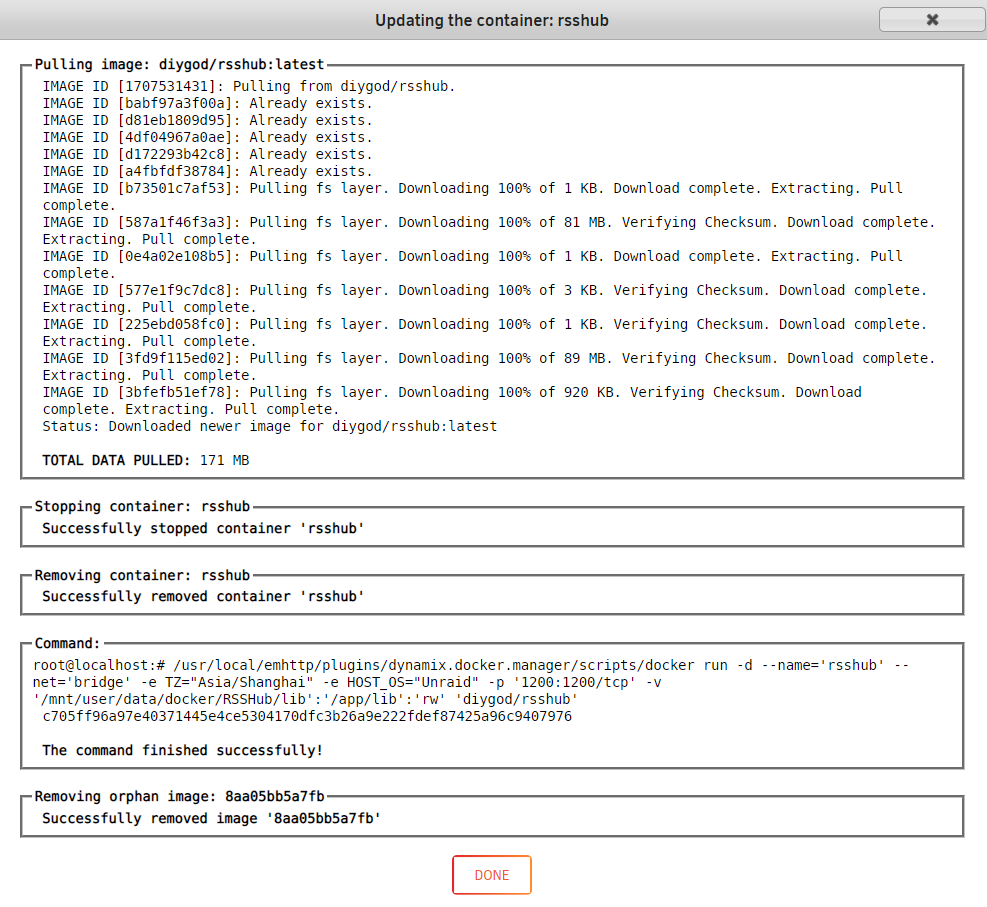
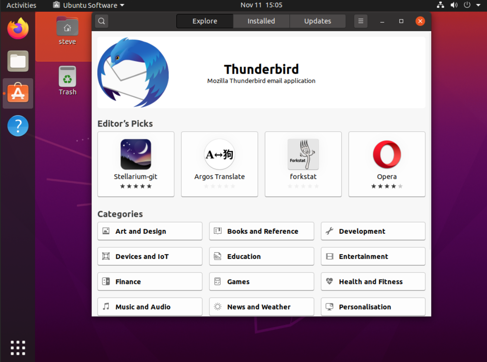
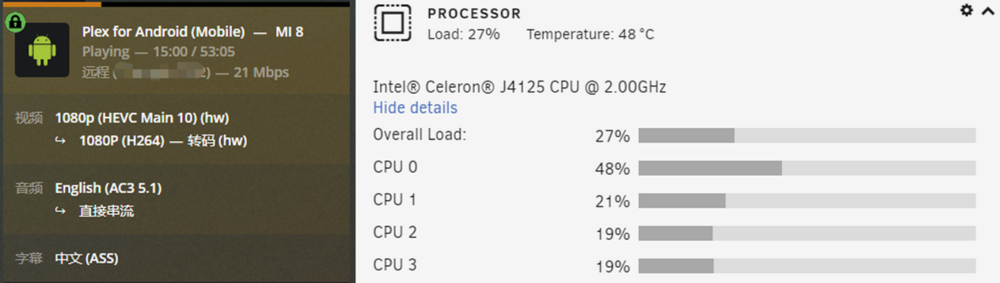
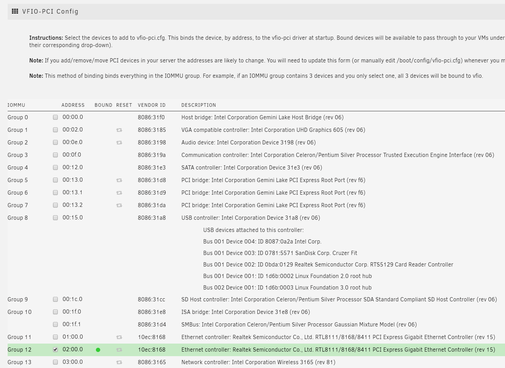
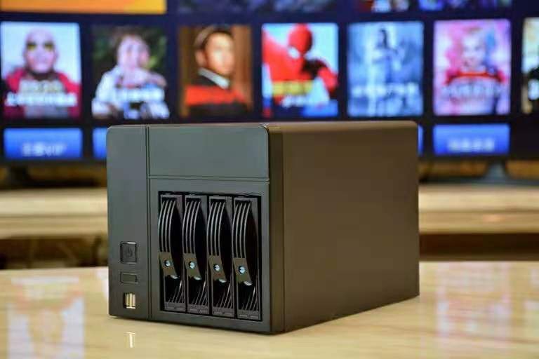
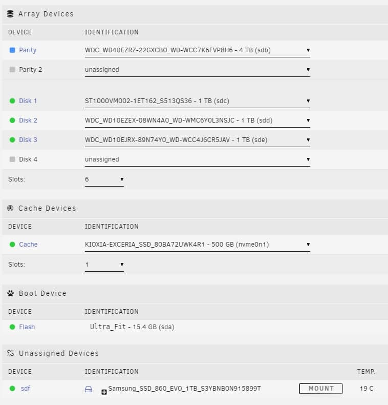
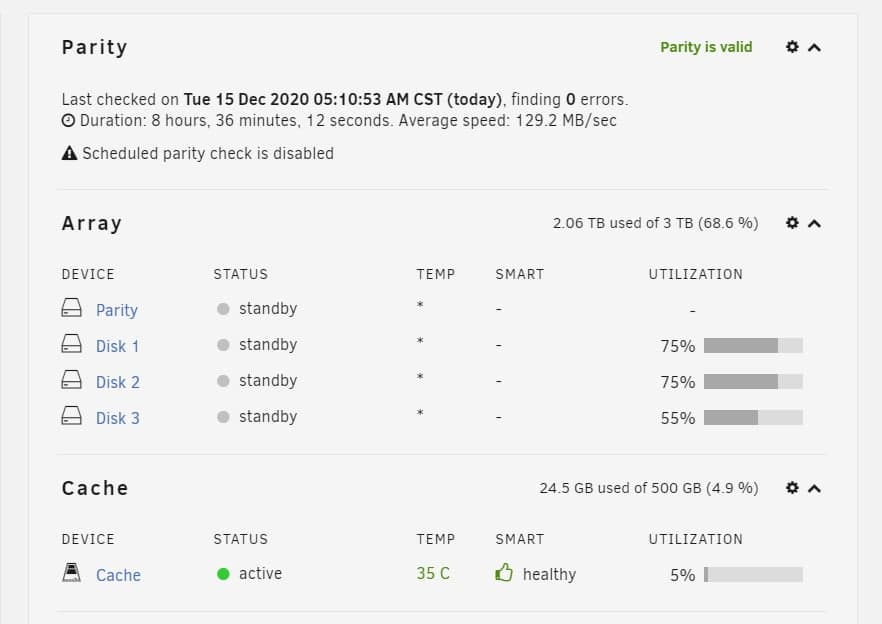

家里一直是一台群晖加一台N1的组合，前者负责存储并跑一些服务，后者跑PT并跑了一个OP旁路，挺科学，也很稳定。然而不知从什么时候起，反复听到Unraid这个系统，心里开始痒痒也想要搞All in one。但我其实不太确定是否可靠，打算体验一下unraid先，于是买了一台J4125的小主机，8+256的配置，计划就是当个小服务器跑跑；最不济，刷成软路由也行。

很小巧的机子，unraid安装也非常简单，单纯把文件拷进U盘即可，然后插U盘启动即可，很快就进入了后台管理页面。

上手后发现硬盘组阵列也很简单，而且很自由，设置也很丰富，比如服务类的存储都限定在固态上，而把媒体类限定在机械上，无访问的情况下硬盘自动休眠，最大程度上保护硬盘及省电。这大约是Unraid相较于群晖类跑raid模式的最大优势吧，也是其名字的由来。实测如果某块硬盘损坏，即使没有校验盘，也只是损失这块硬盘上的内容，于其它资料没关系。不过有的时候丢失部分资料的感觉比丢失全部更让人难受，玩unraid还是得上校验才好。上校验又会涉及读写速度慢的问题，最好配缓存，主板最好有nvme口。我这台暂只一块单SSD用着，没有大文件读写，一般也不容易坏。

阵列启动后，先开始玩docker，有个app市场，本质上是docker模板以及一些plugins的合集，用起来很方便。市场上没有的，就按传统方法装docker。docker装好后管理起来非常方便，随意编辑修改，一键更新，操作更人性化，特别适合我这种docker党。这个要打满分。

插件的更新也是一样，这些插件都挺实用的，不过能集成到系统就更好了，比如APP市场、存储挂载等，内置更合理。

为了能远程调试rsshub，需要git及相应环境。偷懒直接在底层跑，用在Nerd Tools里一键安装了git，并把自己的仓库拉下来。然后跑了一个rsshub的docker，并把路径指好，就算是部署好了调试环境：vscode远程连过去编写路由，然后通过重启docker并看log的方式来调试。然而重启后发现root目录下的ssh、git设置等都没了，因为是U盘引导启动的原因。所以还是得跑个虚拟机，装了ubuntu 20.04，配置好git和环境，专门用来调试rsshub。（update：改为直接用docker跑了一个code-server，ubuntu虚拟机也不需要了，电脑上都不需要装vscode了，浏览器里全搞定）

J4125的集显HD600据说挺强，于是用docker安装了一个PLEX，并挂载了群晖的一个媒体盘作为其媒体库。由于themoviedb等数据库都被墙了，所以必须有前置的科学上网。事实上，unraid使用最好有前置代理，否则app市场都打不开，docker部署也麻烦。不过实测走代理后，本地PLEX与PLEX服务器连接存在问题，我在openclash上设置了DOMAIN-KEYWORD,PLEX,DIRECT，避免向PLEX服务器错误汇报代理的IP。设置好后连接正常，影片及剧的信息都识别很准，即便不观影，光看看海报墙也是舒服的。

然而J4125的硬解我一直有问题，查了才知道是Intel的BUG还没修。实测CPU软解的话，CPU爆炸，勉强也能播放。为避免转码，可以把烧录字幕的选项设置为仅图像，这样可以避免对ASS字幕转码，降低CPU负担，但ASS的特效也就没了，成为普普通通的字幕。还是不甘心，在网上找了好多好多资料，最终终于解决，要求：1、指定i965驱动；2、关闭VT-d；后者是无意间在smzdm的评论中找到的方案，这是一个神奇的网站。

实现硬解之后，实测在播放前还是有几秒的等待时间，但播放过程中是流畅无卡顿的。总体来说，其观影效果很棒，APP胜Jellyfin等十余条街，比Kodi的体验也好很多。为了PLEX硬解，这块CPU真是太心累了，早知道直接上i3 8100之类就会简单很多，忧伤。但是，因为关闭了VT-d，CPU的直通功能也就没了，IOMMU也显示禁用，如果想要直通网卡等进行软路由设定的，就必须有个取舍。我纠结了半天，还是打开了VT-d。

打开直通后，直通了一个网口给openwrt虚拟机作为wan，并把br0和bond0作为lan，从而实现op拨号并跑科学上网，unraid本机以及lan口接出来的ap均能科学上网。实测在op关掉的情况下，还是可以通过lan访问到unraid进行管理，从而方便调试管理，即便玩炸了也不怕。原本我还给unraid配了一个前置的路由器R2S，这下连这个也省了。

---

尝试在家里的黑群上跑PLEX，由于J1900这块CPU太弱鸡，转码基本上都是转圈，暂通过在CoreElec上跑PLEX插件后直接播放，并设置插件自启动。实测整体启动时间和我小米电视的启动时间相当，体验还可以。什么时候安卓上有个Infuse就好了，PLEX真是个让人纠结的东西，但我试了一圈，对于个人影音管理，还是这个最靠谱。

最终换了一台i3 8100T（带HD630集显）的机器，6SATA+nvme+双网口的主板，16G内存，蜗牛机箱，配置已然超过我的台式机了。

跑unraid后可以把老的小容量闲置硬盘都利用起来，组阵列。阵列之外，另有一块500G的nvme当缓存，一块新买的1T的ssd（三星evo860，600T写入）直通给群晖用。

跑了群晖虚拟机，主要用到Drive、Moments、Cloudsync等套件，把家庭照片、个人资料等文件存里面，同时跑onedrive云备份，确保万无一失。跑了一个Openwrt虚拟机，并直通了一个网口进去，当旁路由用，完全可视化操作，比实体软路由刷固件简单多了。跑了一个win10虚拟机，在外面的时候偶尔可以回内网环境调试用。

把Docker、虚拟机等文件夹全部放到缓存，访问快一些，但是没有保护，不过一般也不会丢；以后有机会可以改成raid1。影音媒体等不怎么访问的数据文件存在阵列上，有校验保护。因为unraid支持硬盘无访问自动休眠，对于只有晚上回家偶尔看看电影的用途来说（这其实是大部分家庭的使用场景），比较省电，也比较省硬盘。有了自己的阵列还是挺好的，硬盘滚动换新，相当于有了一种可修复、可成长的生命力，而不是坏了之后只能重建。

跑PLEX后终于可以实现流畅的硬解，播放前缓冲约5秒左右，体验很好。实测在全盘待机情况下功耗约27W，PLEX硬解跑起来的时候约50W。

PLEX在1.20.4.3517版更新后，终于提供了为电视剧库指定用tmdb获取信息的功能，而非原先默认的tvdb。themoviedb听起来是针对电影的，实际上电视剧信息也很全，比tvdb更好，基本可以全自动识别不用纠正。PLEX相较于Jellyfin/Emby的一大优势就是刮削更好用，即便都是指向同样的数据库，这也是我换来换去后最终选择PLEX的主要原因。在没有代理的情况下，可以通过改hosts来解决tmdb无法访问的问题，速度也还可以。不过我还是选择跑了一个clash的docker，然后在PLEX的docker配置中加入代理的环境变量，速度更快一些。

这是一台All in one的机器，通过这一波整合，淘汰了家里用来跑存储的蜗牛星际、用来跑下载及旁路的N1（小钢炮&Openwrt）以及用来当播放器的两台N1（CoreElec），实现了心理上的舒适。
